# reefbeat⚡Backup
> Part of the [**ReefTech Project Ecosystem**](https://elwinmage.github.io/reeftank/)
<p align="center">
  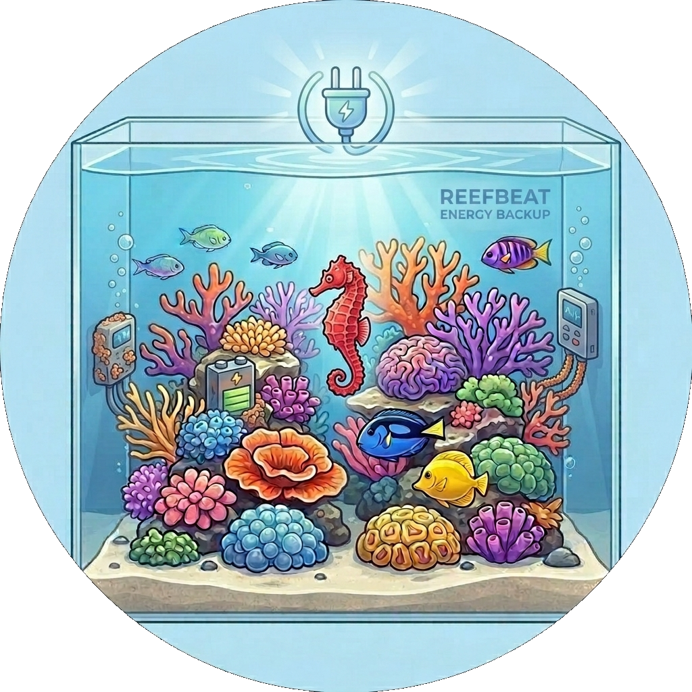
</p>

**🇫🇷 Français** · [🇬🇧 English](README.md)

---

Système autonome de monitoring et de gestion de batterie de secours pour aquarium récifal Red Sea (ReefWave, ReefRun, DC Skimmer, DC Pump).

<!-- ecosystem:start -->

## Projets liés

Les projets ReefTech s'articulent entre eux : les intégrations font entrer votre matériel dans Home Assistant, la carte l'affiche et le pilote, et le secours le maintient en marche pendant une coupure. Chacun fonctionne aussi seul.

<table>
  <tr>
    <th width="100px"></th>
    <th>Projet</th>
    <th>Rôle</th>
    <th>Fonctionne avec</th>
  </tr>
  <tr>
    <td></td>
    <td><a href="https://github.com/Elwinmage/ha-reefbeat-component"><b>ha-reefbeat-component</b></a></td>
    <td>Appareils Red Sea ReefBeat, pilotés en local sans cloud : ReefATO+, ReefControl, ReefControl-Power, ReefDose, ReefLed, ReefMat, ReefRun et ReefWave.<br />Fournit <b>ReefBeat watch</b>, un blueprint d'alertes pour les maintenances dépassées, les modes anormaux, les batteries faibles et les appareils injoignables. <a href="https://my.home-assistant.io/redirect/blueprint_import/?blueprint_url=https://raw.githubusercontent.com/Elwinmage/ha-reefbeat-component/refs/heads/main/blueprints/automation/redsea_alerts.en.yaml"></a></td>
    <td>ha-reef-card</td>
  </tr>
  <tr>
    <td></td>
    <td><a href="https://github.com/Elwinmage/ha-aquamedic-component"><b>ha-aquamedic-component</b></a></td>
    <td>Pompes Aqua Medic via l'API cloud Gizwits : brasseurs EcoDrift et SmartDrift, pompes DC Runner de remontée et d'écumeur.</td>
    <td>ha-reef-card</td>
  </tr>
  <tr>
    <td></td>
    <td><a href="https://github.com/Elwinmage/ha-reef-maintenance-component"><b>ha-reef-maintenance-component</b></a></td>
    <td>Suivi du nettoyage et de l'usure du matériel que Home Assistant ne peut pas interroger : pompes de brassage, pompes de remontée, écumeurs, réacteurs, tout ce que vous entretenez à la main.</td>
    <td>ha-reef-card</td>
  </tr>
  <tr>
    <td></td>
    <td><a href="https://github.com/Elwinmage/ha-reef-card"><b>ha-reef-card</b></a></td>
    <td>Vue graphique interactive de chaque appareil sur votre tableau de bord, et seul moyen d'éditer les programmes avancés. Lit les trois intégrations ci-dessus via le contrat <code>reef_role</code> commun, sans configuration côté carte.</td>
    <td>les trois intégrations</td>
  </tr>
  <tr>
    <td></td>
    <td><b>reefbeatEnergyBackup</b><br /><i>(ce dépôt)</i></td>
    <td>Secours sur batterie en cas de coupure. Pack 24V LiFePO₄ piloté par un Raspberry Pi, avec dégradation progressive de la vitesse des pompes selon l'état de charge.</td>
    <td>seul, ou avec ha-reefbeat-component</td>
  </tr>
</table>

L'ensemble est documenté sur la [page du projet ReefTech](https://elwinmage.github.io/reeftank/).

<!-- ecosystem:end -->

## ⚡ Fonctionnalités

- **Monitoring batterie** via INA226 (I2C, principal) + Victron BLE (auxiliaire optionnel pour l'état du chargeur)
- **Détection de coupure instantanée** via relais 230 V sur GPIO
- **Dégradation progressive des pompes** — niveaux SoC calculés automatiquement à partir d'une cible d'autonomie
- **Contrôle individuel** — chaque ReefWave / ReefRun / Skimmer reçoit sa propre intensité par niveau
- **Failover réseau 3 niveaux** — Wi-Fi normal → reconnexion → hotspot autonome
- **Intégration Home Assistant** — auto-discovery MQTT (10 capteurs + chargeur si Victron)
- **Buffer MQTT avec replay** — les données pendant la coupure HA ne sont jamais perdues
- **Auto-détection** — scanne le réseau pour trouver les équipements ReefBeat pendant la configuration
- **Mise à jour automatique** — vérifie GitHub pour les nouvelles versions, entité `update` dans HA avec bouton "Installer"
- **Redémarrage programmé** — reboot automatique du RPi via cron, annulé si sur batterie
- **Bilingue** — interface FR/EN selon la locale système

## 📋 Sommaire

- [Installation rapide](#-installation-rapide)
- [Niveaux de montage matériel](#-niveaux-de-montage-matériel)
  - [Niveau 1 — Montage de base](#niveau-1--montage-de-base)
  - [Niveau 2 — Montage normal (recommandé)](#niveau-2--montage-normal-recommandé)
  - [Niveau 3 — Montage avancé](#niveau-3--montage-avancé)
  - [Augmentation d'autonomie](#augmentation-dautonomie)
- [Configuration](#-configuration)
- [Home Assistant](#-home-assistant)
- [Blueprint test de batterie](#-blueprint-test-automatique-de-batterie)
- [Structure du projet](#-structure-du-projet)
- [Dépannage](#-dépannage)

---

## 🚀 Installation rapide

```bash
curl -sL https://raw.githubusercontent.com/Elwinmage/reefbeatEnergyBackup/main/install.sh | sudo bash
```

L'installeur :

1. Télécharge la dernière version
2. Active l'I2C du Pi si nécessaire (`raspi-config nonint do_i2c 0`)
3. Installe `python3-rpi-lgpio` (compatible Pi 5 / kernel 6.6+) et les dépendances Python
4. Lance le wizard interactif qui :
   - Scanne le réseau pour trouver les équipements ReefBeat
   - Récupère SSID Wi-Fi et adresses MAC depuis vos équipements
   - Détecte automatiquement votre Raspberry Pi
   - Calcule les niveaux SoC à partir d'une **cible d'autonomie** (12 h, 24 h…)
   - Configure batterie, monitoring INA226 + Victron optionnel, MQTT

---

## 🔧 Niveaux de montage matériel

Le système se construit en trois niveaux, chacun ajoutant des fonctionnalités. Vous pouvez démarrer au niveau 1 et monter progressivement.

### Niveau 1 — Montage de base

<p align="center">
  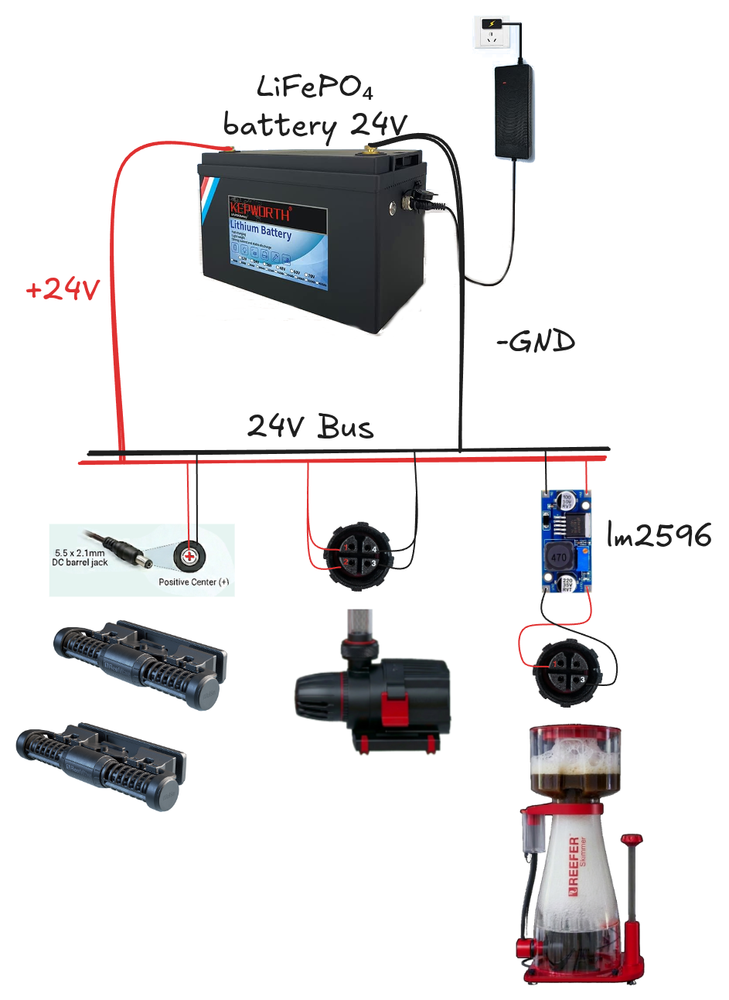
</p>

> **Objectif** : assurer une alimentation des pompes sur batterie en cas de coupure secteur, sans monitoring ni automatisation.

#### 📦 Matériel

| Composant | Modèle suggéré | Prix indicatif |
|---|---|---|
| 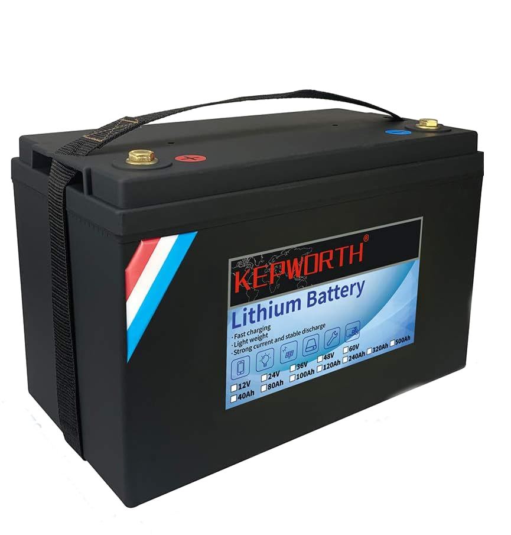 **Batterie LiFePO₄ 24 V 60 Ah** *(chargeur 24V/5A inclus)* | [Kepworth 24V 60Ah](https://www.amazon.fr/dp/B0F3X3LB9K) | ~260 € |
| 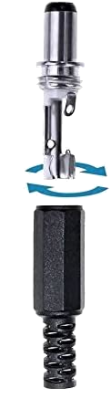 **Connecteur jack adaptateur ReefWave** | Câble jack 5,5 × 2,1 mm vers fils nus | ~5 € |
| 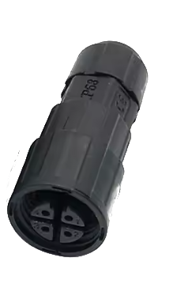 **Connecteur étanche IP68 4 broches ReefRun/Skimmer** | [Connecteur IP68 4 pôles](https://fr.aliexpress.com/item/1005009386771716.html) | ~5 € |
| Câblage (fil 2,5 mm² rouge/noir, cosses, gaine thermo, fusible 15 A) | — | ~20 € |

**Budget niveau 1 : ~290 €**

> 🔊 **Note bruit** : le chargeur fourni avec la batterie Kepworth est équipé d'un ventilateur de refroidissement actif relativement bruyant. Si vous comptez l'installer dans un meuble près d'une zone de vie, prévoyez un placement éloigné (cellier, cave, garage) ou envisagez le passage direct au [niveau 3](#niveau-3--montage-avancé) avec le chargeur Victron Blue Smart, beaucoup plus silencieux (ventilation passive en charge faible).

#### 🔌 Schéma de montage

```
                 230 V
                   │
                   ▼
            ┌─────────────┐
            │  Chargeur   │
            │ 24V 5A inc. │ ← fourni avec la batterie
            └──────┬──────┘
                   │  24 V DC
                   ▼
            ┌─────────────┐
            │  Batterie   │
            │  LiFePO₄    │  ← stocke l'énergie
            │  24V 60Ah   │
            └──────┬──────┘
                   │  24 V DC (avec fusible 15 A)
        ┌──────────┼──────────┐
        │          │          │
        ▼          ▼          ▼
    ┌───────┐ ┌────────┐ ┌─────────┐
    │ReefRun│ │ReefWave│ │DC Skim. │
    │+pumps │ │  jack  │ │connect. │
    └───────┘ └────────┘ └─────────┘
```

#### 📝 Explications

Le principe : **la batterie est en série entre le chargeur et les charges**. Elle est constamment maintenue chargée par le chargeur (fourni avec la batterie Kepworth) en mode flottant, et débite automatiquement quand le secteur tombe — il n'y a aucun commutateur, aucune électronique au milieu.

- **ReefWave** : utilise le **connecteur jack 5,5 × 2,1 mm** (positif au centre)
- **ReefRun et DC Skimmer** : utilisent le **connecteur étanche IP68 4 broches** (la pompe inclut son propre régulateur, le 24 V brut suffit)
- Le chargeur fourni reste branché en permanence : il bascule automatiquement en mode flottant une fois la pleine charge atteinte

#### 🔌 Guide de fabrication des câbles

##### ReefWave — Jack 5,5 × 2,1 mm

<p align="center">
  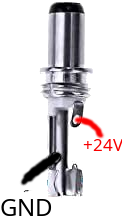
</p>

| Broche | Connexion |
|--------|-----------|
| **Broche centrale** (intérieur) | **+24V** |
| **Manchon extérieur** | **GND (−)** |

Polarité standard positif au centre. Soudez ou sertissez un fil rouge 2,5 mm² sur la broche centrale et un fil noir sur le manchon.

##### ReefRun / DC Skimmer — Connecteur IP68 4 broches

<p align="center">
  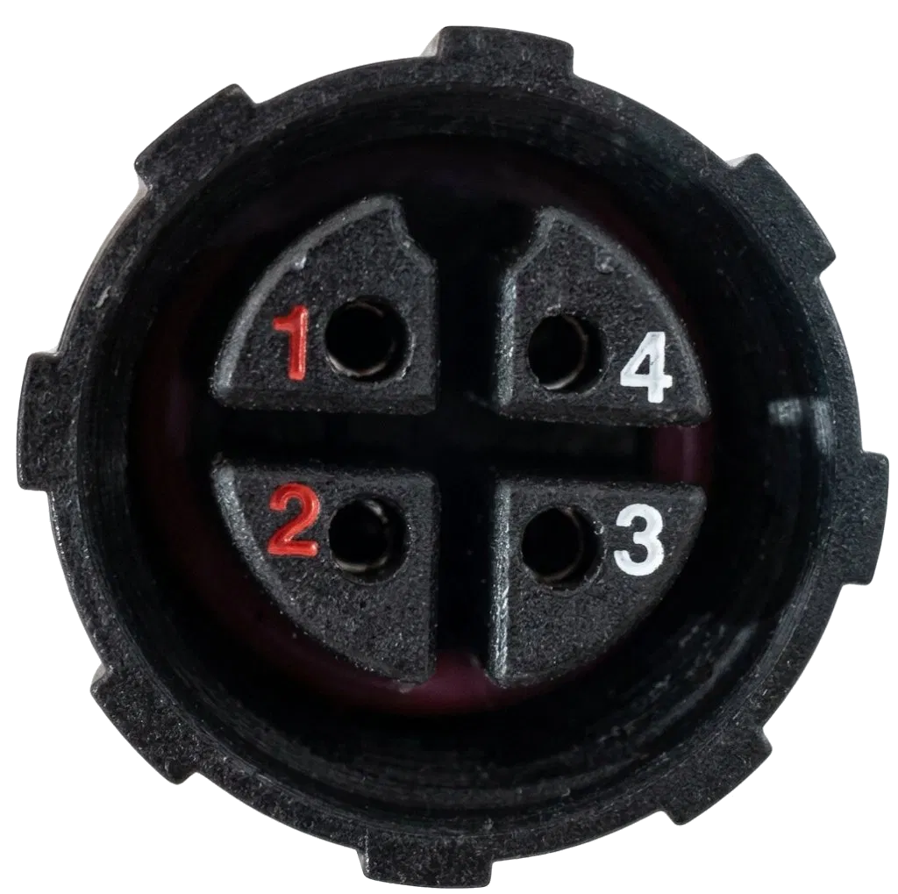
</p>

| Broche | Couleur | Connexion |
|--------|---------|-----------|
| **1** (rouge) | Rouge | **+24V** |
| **2** (rouge) | Rouge | **+24V** |
| **3** (blanc) | Noir | **GND (−)** |
| **4** (blanc) | Noir | **GND (−)** |

> ⚠️ **Distinction importante :**
>
> - **DC Skimmer** (moteur unique) : il suffit de câbler les **broches 1 et 3** (+24V et GND). Les broches 2 et 4 peuvent rester non connectées.
> - **Pompe de remontée (ReefRun)** : il faut **câbler les 4 broches** — broches 1+2 pour le +24V, broches 3+4 pour le GND. La pompe de remontée consomme plus de courant et utilise les deux paires de broches pour répartir la charge. Câbler seulement 2 broches risque de faire surchauffer le connecteur.

> 🔴 **CRITIQUE — vérifiez au multimètre avant le branchement sur la batterie !**
>
> 1. Réglez votre multimètre en mode **tension continue (DC V)**
> 2. Touchez les sondes sur les broches 1 (+) et 3 (−) de votre câble assemblé
> 3. Connectez brièvement à la batterie
> 4. Vérifiez que vous lisez **+24V à +28V** (pas négatif !)
> 5. Une inversion de polarité **détruira** le contrôleur ReefBeat instantanément
>
> **Vérifiez chaque câble avant la première utilisation. Il n'y a pas de deuxième chance.**

> ⚠️ **Sécurité** : un **fusible 15 A** sur le pôle + de la batterie, juste après celle-ci, est obligatoire. Ce calibre est calé sur la capacité du câble 2,5 mm² (~16 A maximum) et offre une marge confortable face à une consommation pic typique de ~9 A (2× ReefWave 45 + ReefRun 12000 + Skimmer + Pi). En cas de court-circuit côté charges, c'est ce qui sauve la batterie (et la maison).

> 🔧 **Problème sonde de godet du DC Skimmer** : alimenté par la batterie LiFePO₄ (26-27V au lieu du 24V d'origine), la **sonde de godet plein de l'écumeur devient peu fiable** — elle déclenche de fausses alarmes « godet plein » même après recalibration. C'est une limitation matérielle de la sonde à tension plus élevée.
>
> **Solution recommandée** : ajouter un [LM2596 DC-DC buck converter](https://www.amazon.fr/dp/B0FLYNNNW) (~2€) entre le bus batterie et le skimmer uniquement, réglé à 24,0V en sortie.
>
> <p align="center">
>   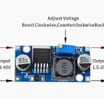
> </p>
>
> Câblez-le sur le connecteur IP68 du skimmer (broches 1+3 uniquement). Refaites ensuite une calibration de la sonde via l'app ReefBeat, l'intégration [ha-reefbeat-component](https://github.com/Elwinmage/ha-reefbeat-component) ou la carte [ha-reef-card](https://github.com/Elwinmage/ha-reef-card). Les ReefWave et ReefRun restent branchés directement sur la batterie — ils fonctionnent très bien à 26-27V.

#### ✅ Ce que vous obtenez

- Continuité électrique pendant les coupures (autonomie ~6-12 h selon vos pompes)
- Aucune intervention nécessaire à la coupure
- Aucun monitoring, aucune dégradation : les pompes tournent à 100 % jusqu'à ce que la batterie soit vide

#### ❌ Limitations

- Aucune visibilité sur l'état de la batterie
- Aucune gestion de la dégradation : la batterie se vide vite, tout s'éteint d'un coup à la fin
- Risque de décharge profonde répétée → vieillissement accéléré

---

### Niveau 2 — Montage normal *(recommandé)*

<p align="center">
  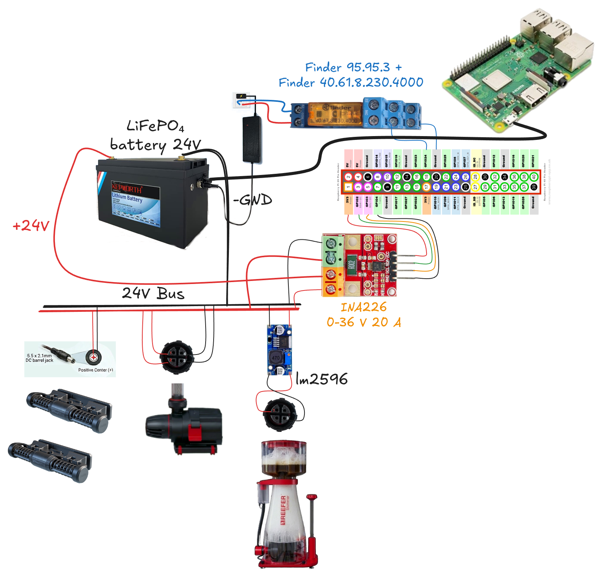
</p>

> **Objectif** : ajouter le monitoring batterie temps réel, la détection automatique de coupure, et la dégradation progressive des pompes selon le SoC. C'est le niveau **recommandé** pour une installation pérenne.

#### 📦 Matériel additionnel (en plus du niveau 1)

| Composant | Modèle suggéré | Prix indicatif |
|---|---|---|
| 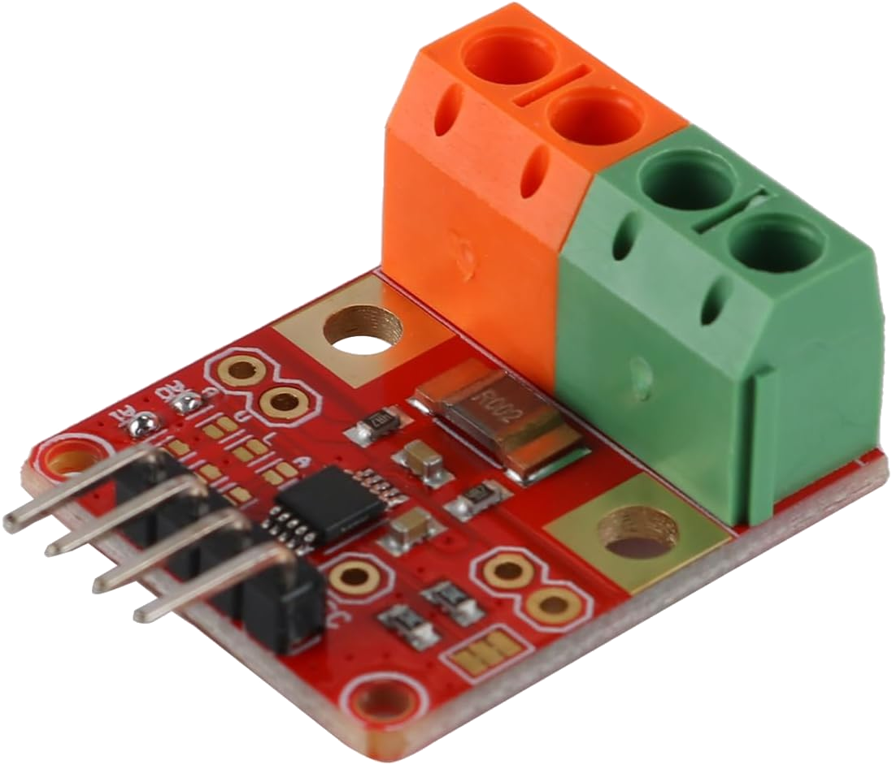 **Module INA226 0-36V/20A** (shunt 2 mΩ embarqué) | [Fasizi INA226 20A](https://www.amazon.fr/dp/B0B7MYYT2V) | ~14 € |
| 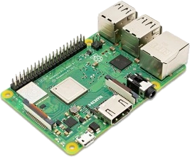 **Raspberry Pi 3 B+** (ou plus récent) | [Pi 3 B+ 1 Go chez Kubii](https://www.kubii.com/fr/cartes-nano-ordinateurs/2119-raspberry-pi-3-modele-b-1-gb-kubii-5056561800318.html) | ~40 € |
| Carte microSD 16 Go classe 10 + alim USB du Pi | — | ~15 € |
| Convertisseur DC-DC 24 V → 5 V 3 A pour le Pi | Step-down buck regulator | ~8 € |
| 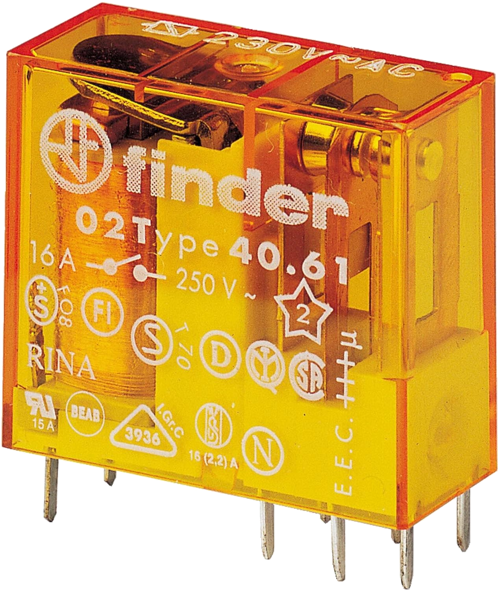 **Relais Finder 40.61.8.230.4000** (bobine 230 V, 1 NO/NC) | [Finder 40.61](https://www.amazon.fr/dp/B003A611AE) | ~12 € |
| 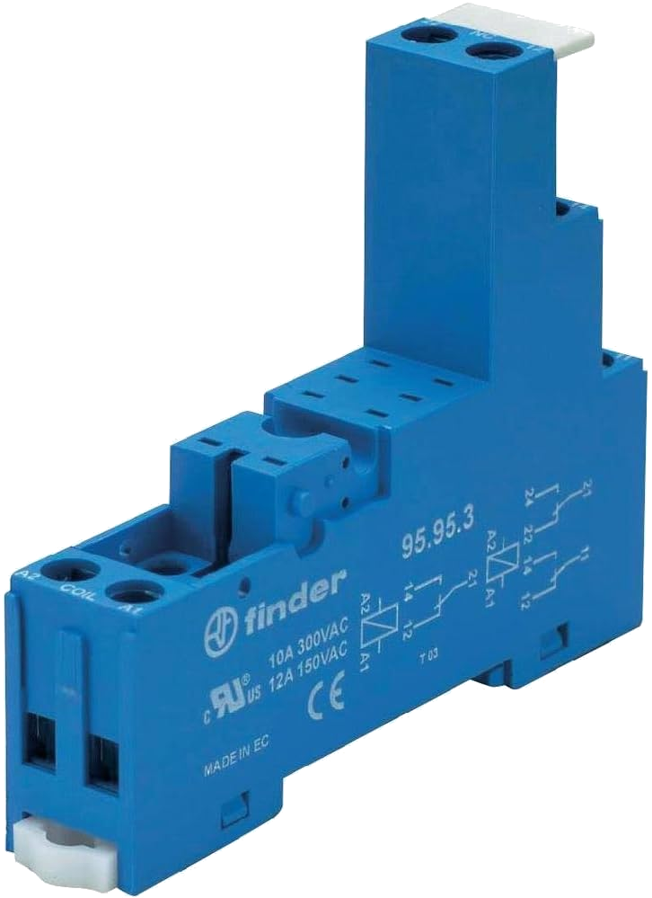 **Socle DIN Finder 95.95.3** | [Finder 95.95.3](https://www.amazon.fr/dp/B0018L99AC) | ~8 € |
| Rail DIN 35 mm (10 cm) + petit boîtier électrique | — | ~15 € |

**Budget additionnel : ~112 €** — **Budget cumulé niveau 2 : ~402 €**

#### 🔌 Schéma de montage

```
                 230 V ─────┬───────────────┐
                            │               │
                            ▼               ▼
                     ┌─────────────┐   ┌──────────┐
                     │  Chargeur   │   │  Relais  │
                     │ Victron 24V │   │  Finder  │
                     └──────┬──────┘   │   40.61  │
                            │ 24V      │  bobine  │
                            ▼          │   230V   │
                     ┌─────────────┐   └────┬─────┘
                     │  Batterie   │        │ NO/NC
                     │  LiFePO₄    │        │ contact
                     └──────┬──────┘        │
                            │ 24V           │
                     ┌──────────────┐       │
                     │ Shunt INA226 │       │
                     └──┬───────┬───┘       │
                   I2C  │       │ 24V       │
                 SDA/SCL│       ▼           │
                        │ ┌────────────┐    │
                        │ │DC-DC 24V→5V│    │
                        │ └─────┬──────┘    │
                        │       │ 5V        │
                        │       ▼           │
                        │ ┌────────────┐    │
                        └─│Raspberry Pi│◄───┘
                          │  GPIO 26   │ GPIO state
                          │  GPIO 2 SDA│
                          │  GPIO 3 SCL│
                          └────────────┘
                                │
                                ▼
                  ReefRun / ReefWave / DC Skimmer
```

#### 📝 Explications

**Câblage du shunt INA226** (le plus important) :

Le module INA226 doit être **en série sur le pôle + de la batterie**, entre la batterie et toutes les charges. C'est ce qui lui permet de mesurer le courant net entrant/sortant.

```
Batterie (+) ──► [IN+ shunt INA226 IN−] ──► Bus + 24V ─┬─► Chargeur (sortie)
                                                        ├─► DC-DC vers Pi
                                                        ├─► ReefRun
                                                        ├─► ReefWave
                                                        └─► DC Skimmer

Batterie (−) ──────────────────────────► Bus − (commun)
```

Le shunt voit donc :
- **courant positif** = la batterie débite (décharge ou alimentation des charges)
- **courant négatif** = la batterie reçoit (charge depuis le Victron)

**Câblage du relais de détection de coupure** :

Le relais Finder 40.61.8.230 est un **détecteur d'absence de tension secteur** : sa bobine est alimentée en 230 V, ses contacts NO/NC basculent quand le secteur tombe.

| Borne du socle 95.95.3 | Connexion |
|---|---|
| A1 | Phase 230 V |
| A2 | Neutre 230 V |
| 11 (commun) | GND du Pi (Pin 39) |
| 12 (NC) | Pin 37 du Pi (GPIO 26, avec pull-up interne) |

Sur secteur OK, la bobine est alimentée → contact NC ouvert → GPIO lit 1 (tiré vers 3.3 V par pull-up).
Sur coupure, la bobine retombe → contact NC fermé → GPIO tiré à GND, lit 0.

**Connexions Pi → INA226** (4 fils) :

| Pi GPIO | INA226 |
|---|---|
| Pin 1 (3.3 V) | VCC |
| Pin 6 (GND) | GND |
| Pin 3 (GPIO 2 SDA) | SDA |
| Pin 5 (GPIO 3 SCL) | SCL |

#### ✅ Ce que vous obtenez

- **Monitoring temps réel** : tension batterie, courant, puissance, SoC calculé en coulomb counting
- **Détection de coupure en < 1 seconde** via le relais
- **Dégradation automatique** : les ReefWave passent à 70 %, puis 50 %, puis 10 % au fil du SoC qui baisse ; le skimmer s'arrête en mode survie ; etc.
- **Snapshots de configuration** : à la coupure, la conf d'origine de chaque pompe est sauvegardée sur disque ; au retour, elle est restaurée à l'identique
- **Buffer MQTT** : pendant que HA est down (ce qui arrive presque toujours pendant une vraie coupure), les mesures sont stockées localement et rejouées dès que le broker remonte → vous avez la **courbe de décharge complète** dans HA
- **Failover réseau** : si la box Wi-Fi tombe aussi, le Pi bascule en hotspot pour rester joignable

---

### Niveau 3 — Montage avancé

<p align="center">
  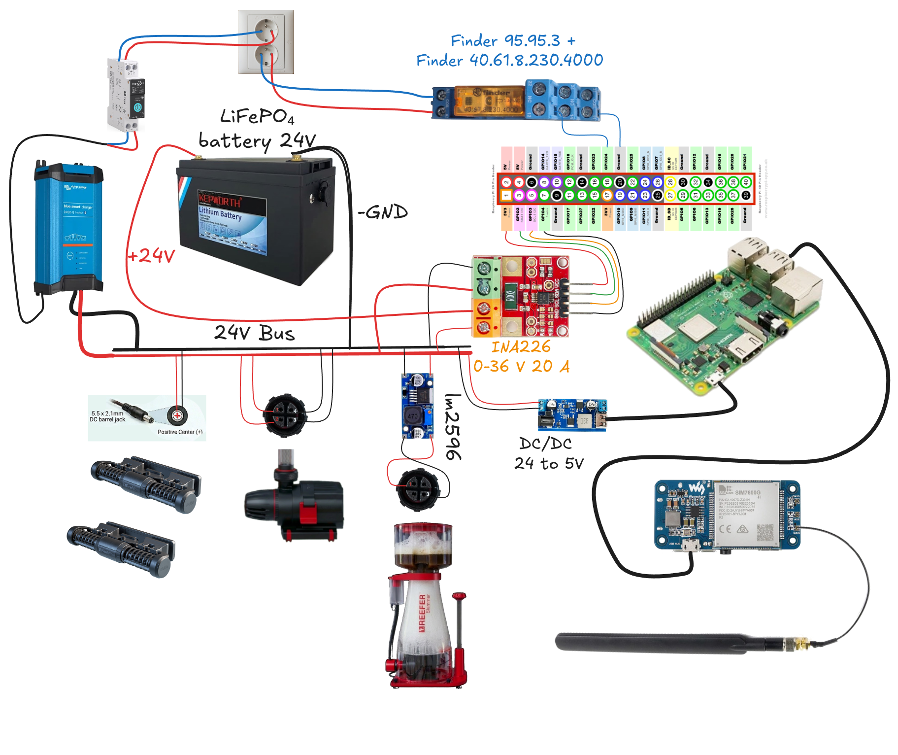
</p>

> **Objectif** : ajouter le contrôle à distance du chargeur, un disjoncteur connecté pour pouvoir déclencher des **tests de décharge programmés** depuis Home Assistant, et un modem 4G pour les notifications même quand tout le réseau est coupé.
>
> Les trois ajouts de ce niveau sont **indépendants** — vous pouvez installer la combinaison de votre choix :

| Ajout | But | Installable seul ? |
|---|---|---|
| 🔌 **Chargeur Victron BLE** | Chargeur silencieux + état chargeur dans HA | ✅ Oui |
| ⚡ **Disjoncteur connecté** | Tests de décharge automatisés depuis HA | ✅ Oui |
| 📶 **Module 4G LTE** | Notifications + accès cloud ReefBeat quand le Wi-Fi est coupé | ✅ Oui |

#### 📦 Matériel additionnel (en plus du niveau 2)

| Composant | Modèle suggéré | Prix indicatif |
|---|---|---|
| 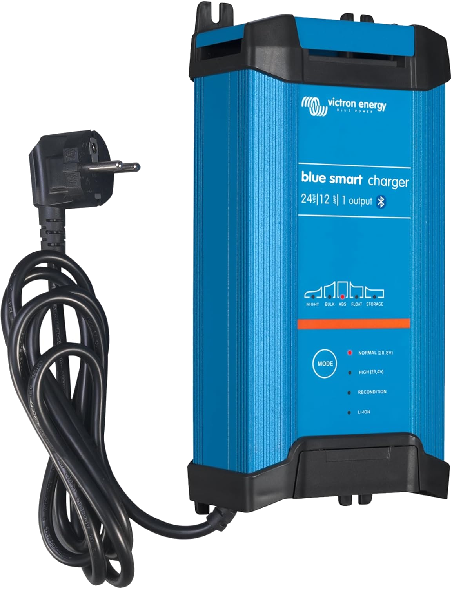 **Chargeur Victron Blue Smart IP22 24/12** *(remplace le chargeur Kepworth fourni — silencieux + BLE)* | [Victron Blue Smart IP22 24/12](https://www.amazon.fr/dp/B08P4Z8NL6) | ~155 € |
| 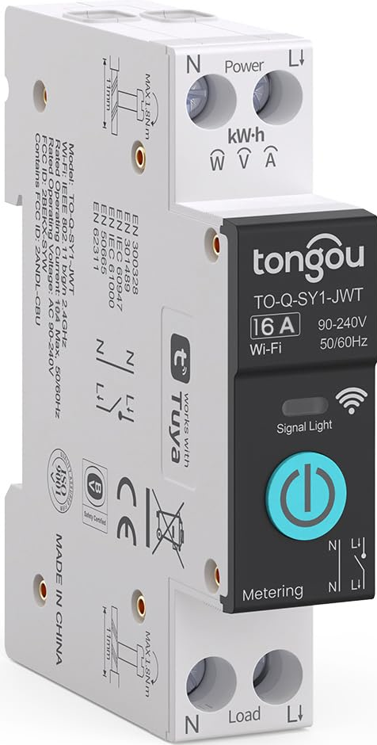 **Disjoncteur connecté Wi-Fi 16 A avec compteur** | [Tongou TO-Q-SY1-JWT](https://www.amazon.fr/dp/B08ND2RGX8) | ~30 € |
| 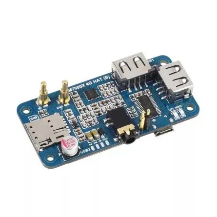 **SIM7600G-H 4G HAT** *(recommandé — intégré sur le Pi, RNDIS)* | [Kubii SIM7600G-H HAT](https://www.kubii.com/fr/hat-cartes-d-extensions/3296-module-hat-lte-cat-4-4g-3g-2g-pour-raspberry-pi-3272496306189.html) | ~75 € |
| 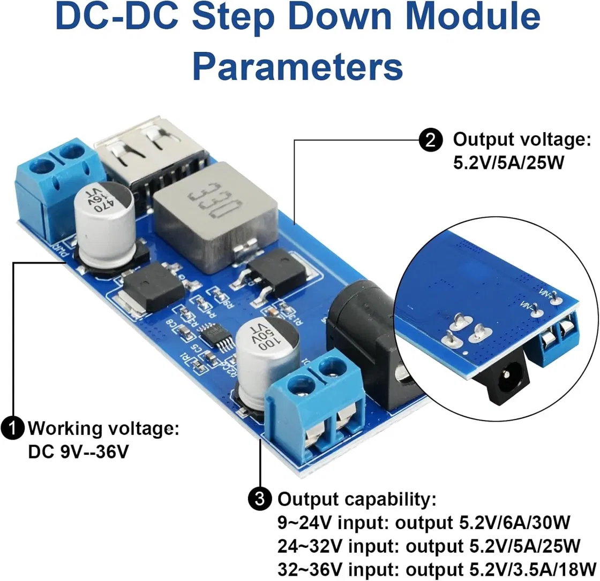 **Module DC-DC 24V→5V 5A** *(nécessaire si SIM7600 HAT — l'USB de la batterie seul ne peut pas alimenter les deux)* | [DC-DC Buck 9-36V vers 5.2V 5A](https://www.amazon.fr/dp/B0F9FLF6QB) | ~2,50 € |

*Ou en alternative au SIM7600 :*

| Composant | Modèle suggéré | Prix indicatif |
|---|---|---|
| 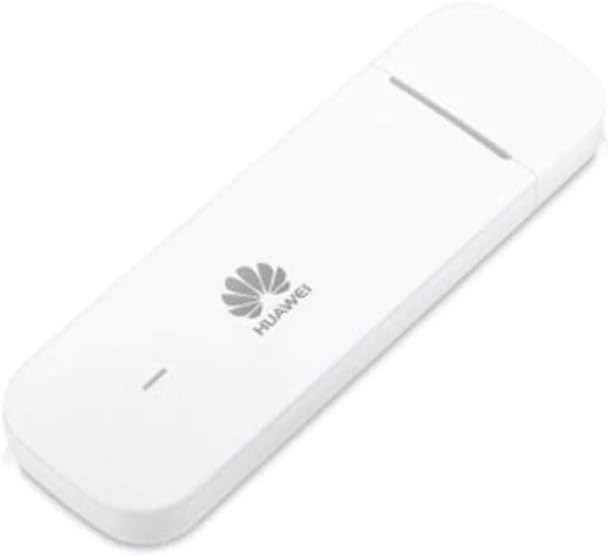 **Modem USB 4G Huawei E3372h-320** *(plug-and-play, pas de puissance supplémentaire)* | [Huawei E3372h-320](https://www.amazon.fr/HUAWEI-51071SMK-Huawei-E3372h-320-LTE-Stick/dp/B085RDTZMP) | ~40 € |
| **Tethering USB depuis un smartphone** *(pas de matériel supplémentaire, téléphone alimenté via USB du RPi)* | — | 0 € |

**Budget additionnel maximal : ~262 €** (les trois avec SIM7600) — **Budget cumulé niveau 3 : ~664 €**

#### 🔌 Schéma de montage

```
        230 V ──► [Disjoncteur Tongou Wi-Fi] ──┬──────────────┐
                                                │              │
                                                ▼              ▼
                                         ┌─────────────┐   ┌──────────┐
                                         │ Chargeur    │   │  Relais  │
                                         │Victron BLE  │   │  Finder  │
                                         │24/12 Smart  │   │ détection│
                                         └──────┬──────┘   └────┬─────┘
                                                │ 24 V           │
                                                ▼                │
                                         ┌─────────────┐         │
                                         │  Batterie   │         │
                                         └──────┬──────┘         │
                                                │ 24 V           │
                                         [shunt INA226]          │
                                                │                │
                                                ▼                │
                                          (charges)              │
                                                                 │
                                          ┌──── Wi-Fi ───┐       │
                                          │              │       │
                                          ▼              ▼       │
                                    Home Assistant   Raspberry Pi
                                    (intégration         GPIO 26 ◄┘
                                     Tongou)              │
                                          │            USB │
                                          │ BLE           ▼
                                          ▼         ┌───────────┐
                                    Chargeur Victron│  Huawei   │
                                    (état temps réel│ E3372h    │
                                                   │  4G LTE   │
                                                   └───────────┘
```

#### 📝 Explications

**Disjoncteur Tongou TO-Q-SY1-JWT** :

Disjoncteur DIN modulaire qui se commande via Wi-Fi (protocole Tuya, intégrable à HA via [Local Tuya](https://github.com/rospogrigio/localtuya) ou l'intégration Tuya Cloud officielle). Il fournit aussi la mesure consommation en kWh / V / A en temps réel — utile pour vérifier que le chargeur bascule bien sur batterie quand on simule une coupure.

**Câblage** : le disjoncteur s'installe **juste avant** le chargeur Victron et le relais Finder. Quand on le coupe via HA, c'est exactement comme une vraie coupure secteur :

- Le chargeur ne fournit plus rien
- Le relais Finder voit l'absence de tension → bascule de contact
- Le Pi voit la coupure via GPIO et déclenche immédiatement la dégradation

**Chargeur Victron Blue Smart IP22 24/12 (avec BLE)** :

Remplace le chargeur Kepworth fourni avec la batterie. Outre l'ajout du Bluetooth Low Energy, **il est nettement plus silencieux** : ventilation passive en charge faible, le ventilateur ne se déclenche qu'en pleine charge à plus de 8 A. Idéal si le système est installé dans une pièce de vie.

Permet de remonter dans HA :
- L'état du chargeur (`storage` / `bulk` / `absorption` / `float`)
- La tension et le courant de sortie temps réel
- Les éventuelles erreurs (overheat, battery voltage out of range…)

Configuration : récupérer la **clé de chiffrement** depuis l'app VictronConnect (Settings → Product Info → Instant Readout → "Show"), à entrer dans le wizard de configuration.

**SIM7600G-H 4G HAT** *(recommandé)* :

<p align="center">
  
</p>

Le [SIM7600G-H HAT](https://www.kubii.com/fr/hat-cartes-d-extensions/3296-module-hat-lte-cat-4-4g-3g-2g-pour-raspberry-pi-3272496306189.html) (~75€) se connecte au Raspberry Pi via USB. LTE Cat4 150 Mbps, bandes mondiales, avec positionnement GNSS.

Le wizard le configure automatiquement en **mode RNDIS** — le module apparaît comme une interface réseau USB (`usb0`) avec DHCP. Pas de PPP, QMI, ou commandes AT nécessaires pour la data après la configuration initiale.

**Configuration initiale** (gérée par le wizard) :
1. Configurer l'APN : `AT+CGDCONT=1,"IP","votre_apn"`
2. Basculer en RNDIS : `AT+CUSBPIDSWITCH=9011,1,1`
3. Le module redémarre → `usb0` apparaît avec une IP via DHCP

Après la configuration initiale, le module démarre automatiquement en RNDIS à chaque démarrage du RPi — totalement autonome.

> ⚡ **Note alimentation** : le port USB de la batterie peut alimenter le Pi seul (~2,1A), mais **pas le Pi et le SIM7600 HAT ensemble**. Avec le SIM7600, alimentez le RPi en USB via un [module DC-DC 24V→5V 5A](https://www.amazon.fr/dp/B0F9FLF6QB) (~2,50€) connecté au bus +24V de la batterie.

**Test :** `python3 test_sim7600.py` lance un diagnostic complet (série, SIM, signal, réseau, connectivité).

**Monitoring LTE** : toutes les 10 minutes (configurable), le système interroge le modem via commandes AT et publie dans HA : force du signal (dBm), qualité, opérateur, type de réseau (4G/3G/2G), état SIM, modèle, firmware, IMEI, IP et état de connectivité.

##### Alternative Huawei E3372h-320

<p align="center">
  
</p>

L'[E3372h-320](https://www.amazon.fr/HUAWEI-51071SMK-Huawei-E3372h-320-LTE-Stick/dp/B085RDTZMP) (~40€) est une option plus simple plug-and-play. Il suffit de le brancher sur un port USB du Pi avec une carte SIM active — il crée une interface Ethernet virtuelle (`eth1`), aucune configuration nécessaire. Interface web HiLink sur `http://192.168.8.1`.

> 🔑 **Code PIN SIM** : pendant la configuration, le wizard détecte si la SIM demande un PIN, le saisit, et propose de **le désactiver définitivement**. Fortement recommandé — sans ça, le modem ne peut pas se reconnecter après un cycle d'alimentation.

##### Alternative tethering USB

Si vous ne souhaitez pas acheter un modem, vous pouvez utiliser un **smartphone branché en USB** comme modem 4G/5G. Activez le partage de connexion USB sur le téléphone (Paramètres → Réseau → Point d'accès → Partage USB), branchez-le au RPi. Le téléphone est alimenté via USB par le RPi (qui est sur batterie), il reste donc chargé pendant la coupure.

**Passerelle internet 4G pour les ReefBeat** *(les trois options LTE)* : quand le hotspot RPi est actif, le RPi fait office de routeur NAT — il redirige le trafic internet des ReefBeat à travers la 4G. **L'app mobile Red Sea continue de fonctionner** pendant une coupure.

#### ✅ Ce que vous obtenez

- **Contrôle distant du secteur** vers la batterie depuis HA
- **Tests de décharge programmés** : voir la [section blueprint](#-blueprint-test-automatique-de-batterie)
- **Visibilité complète** sur le chargeur (mode, courant, erreurs)
- **Mesure de la consommation totale** en kWh via le disjoncteur Tongou
- **Notifications même quand tout est coupé** via 4G LTE
- **L'app mobile Red Sea continue de fonctionner** pendant les coupures (passerelle 4G)
- **Télémétrie LTE dans HA** — signal, opérateur, type réseau, état SIM, IMEI

---

### Augmentation d'autonomie

<p align="center">
  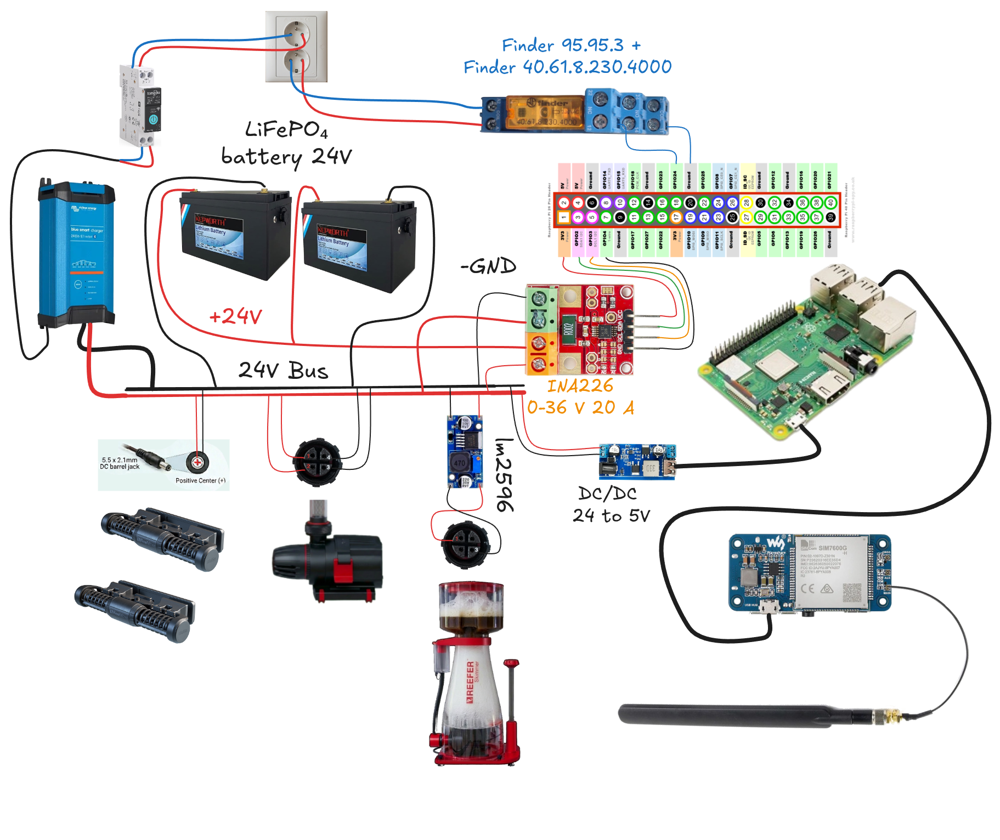
</p>

> **Objectif** : doubler (ou plus) la capacité batterie pour des coupures plus longues.

Le moyen le plus simple et le plus sûr est d'ajouter une ou plusieurs **batteries identiques en parallèle**. Les batteries LiFePO₄ avec BMS interne (comme la Kepworth 24V 60Ah) acceptent ce mode de fonctionnement nativement.

#### 📦 Matériel par batterie additionnelle

| Composant | Prix indicatif |
|---|---|
| 1× batterie LiFePO₄ 24V 60Ah identique | ~260 € |
| 2× câbles de liaison 2,5 mm² (50 cm rouge + 50 cm noir, cosses serties) | ~10 € |
| 1× fusible **inline 15 A** (un par batterie additionnelle) | ~3 € |

**Budget par +60 Ah : ~273 €**

#### 🔌 Schéma de montage parallèle

```
                Bus + (vers chargeur et charges)
                      ▲
                      │
        ┌─────────────┼─────────────┐
        │             │             │
   [fusible]     [fusible]      [fusible]
   15 A          15 A           15 A
        │             │             │
   ┌────┴────┐   ┌────┴────┐   ┌────┴────┐
   │ Bat #1  │   │ Bat #2  │   │ Bat #3  │
   │24V 60Ah │   │24V 60Ah │   │24V 60Ah │
   └────┬────┘   └────┬────┘   └────┬────┘
        │             │             │
        └─────────────┼─────────────┘
                      │
                      ▼
                Bus − (commun)
```

#### 📝 Règles importantes

1. **Batteries identiques uniquement** : même marque, même modèle, idéalement même âge. Mélanger des batteries de capacités ou d'âges différents fait travailler la plus faible en surcharge → vieillissement accéléré.
2. **Équilibrage initial** : avant la mise en parallèle, charger chaque batterie individuellement à 100 % et vérifier qu'elles sont à la même tension (±0,1 V). Sinon, l'équilibrage se fera par un courant fort entre batteries au branchement → risque de fusion des cosses.
3. **Câbles de liaison de section égale** : si une batterie a un câble plus long ou plus fin que les autres, elle débitera moins → déséquilibre permanent.
4. **Un fusible par batterie**, pas un seul fusible commun : en cas de défaut sur une batterie, seule celle-là est isolée.
5. **Pas de modification du shunt INA226** : il reste sur le bus commun, il voit alors le courant **total** des deux batteries cumulées — c'est exactement ce qu'on veut pour le SoC.

#### 📊 Capacités cumulées et autonomies estimées

Pour un setup typique (2× ReefWave 45 + 1× ReefRun 12000 + DC Skimmer + Pi) :

| Configuration | Capacité utile | Autonomie cible 24 h |
|---|---|---|
| 1× 60 Ah | 1228 Wh | atteignable (estimé 32 h) |
| 2× 60 Ah | 2457 Wh | confortable (estimé 60 h+) |
| 3× 60 Ah | 3686 Wh | luxueuse (90 h+) |

> ⚠️ Re-lancez le wizard `configure.py` après ajout d'une batterie pour mettre à jour la capacité totale dans `config.json`. Le calcul de scénario en tiendra compte automatiquement.

---

## ⚙️ Configuration

Le wizard `configure.py` est interactif et bilingue (FR/EN selon la locale). Il guide à travers 6 étapes :

1. **Réseau** — confirmation du SSID Wi-Fi domestique (lu depuis NetworkManager)
2. **Détection des équipements ReefBeat** — scan automatique du sous-réseau, sélection des équipements à mettre sur batterie
3. **Détection de coupure** — choix entre relais GPIO (recommandé) et monitoring de courant
4. **Batterie** — capacité (Ah) du pack
5. **Monitoring** — INA226 (obligatoire, détection auto sur I2C) + Victron BLE (optionnel)
6. **Mode de secours** — choix entre :
   - **Auto** (recommandé) : on donne une cible d'autonomie, le wizard détecte le Pi, demande les charges auxiliaires, et calcule les niveaux SoC + intensités optimales
   - **Simple** : une seule vitesse de secours sur tout

Le résultat est sauvegardé dans `config.json` et peut être édité à la main si besoin.

---

## 🔀 Failover réseau — flux complet

Lorsqu'une coupure de courant est détectée et que le routeur tombe, voici la séquence complète :

```
Coupure détectée (relais GPIO, instantané)
    │
    ▼  attente 30s (configurable, pour laisser le routeur sur onduleur)
    │
    ├── Étape 1 : ping des contrôleurs ReefBeat via Ethernet (eth0)
    │       │
    │       ├── OK → Ethernet fonctionne encore (tous les switchs ont survécu)
    │       │        → réduction intensité pompes via eth0, terminé
    │       │
    │       └── ÉCHEC → Ethernet coupé (un switch entre le RPi et le routeur a lâché)
    │
    ├── Étape 2 : scan Wi-Fi du SSID maison
    │       │
    │       ├── TROUVÉ → le routeur est vivant (sur onduleur) mais un switch est mort
    │       │             → le RPi se connecte au Wi-Fi maison (wlan0)
    │       │             → contrôle des ReefBeat via Wi-Fi
    │       │             → surveillance : si le Wi-Fi tombe plus tard → Étape 3
    │       │
    │       └── ABSENT → le routeur est déjà mort
    │                     → passage à l'Étape 3
    │
    └── Étape 3 : création du hotspot miroir (même SSID + mot de passe sur wlan0)
            │
            ├── Les ReefBeat se reconnectent auto au hotspot du RPi
            │    (ils connaissent déjà le SSID/mot de passe)
            │
            ├── Le RPi pilote les pompes en local via API HTTP
            │
            ├── Si modem 4G (E3372h ou tethering USB) disponible :
            │       │
            │       ├── NAT activé : hotspot (wlan0) → 4G (eth1/usb0)
            │       │
            │       ├── ReefBeat → cloud Red Sea → app mobile ✅
            │       │
            │       └── Notifications ntfy.sh via 4G → votre téléphone ✅
            │
            └── Si pas de 4G :
                    └── Contrôle local uniquement (pompes gérées, pas d'internet)


    ⏳ Pendant la coupure, le système surveille en continu :
    │
    ├── SoC batterie → ajuste l'intensité des pompes (eco → survival → critical)
    ├── Disponibilité Wi-Fi → si le Wi-Fi maison réapparaît, rebascule depuis le hotspot
    └── Connectivité 4G → route les notifications et le trafic ReefBeat


Retour du courant (relais GPIO, instantané)
    │
    ├── Hotspot désactivé (si actif), règles NAT nettoyées
    │
    ├── Le RPi repasse sur Ethernet (eth0) quand les switchs reviennent
    │    (automatique — Linux priorise eth0 sur wlan0)
    │
    ├── Les ReefBeat se reconnectent au Wi-Fi du routeur
    │
    ├── Configuration des pompes restaurée (nominale avant coupure)
    │
    ├── Buffer MQTT rejoué → HA reçoit la courbe de décharge complète
    │
    └── Notification ntfy : "Courant rétabli après Xh, SoC Y%"
```

---

## 🏠 Home Assistant

### Capteurs auto-publiés

Tous les capteurs apparaissent automatiquement dans HA après publication des configs MQTT discovery.

| Capteur | Description |
|---|---|
| `sensor.reef_battery_voltage` | Tension batterie (V) |
| `sensor.reef_battery_current` | Courant (A, + = décharge) |
| `sensor.reef_battery_power` | Puissance (W) |
| `sensor.reef_battery_soc` | State of Charge (%) |
| `sensor.reef_battery_power_state` | mains / battery |
| `sensor.reef_battery_pump_intensity` | Intensité pompes moyenne (%) |
| `sensor.reef_battery_runtime` | Autonomie estimée (h) |
| `sensor.reef_battery_outage_duration` | Durée coupure courante (min) |
| `sensor.reef_battery_network_mode` | client / rejoin / hotspot |
| `sensor.reef_battery_monitor_source` | ina226 |

**Si Victron BLE est configuré** (niveau 3) :

| Capteur | Description |
|---|---|
| `sensor.reef_battery_charger_voltage` | Tension de sortie chargeur (V) |
| `sensor.reef_battery_charger_current` | Courant de sortie chargeur (A) |
| `sensor.reef_battery_charger_state` | bulk / absorption / float / storage |
| `sensor.reef_battery_charger_error` | no_error / … |

### Buffer MQTT

Pendant une coupure, HA et le broker MQTT sont presque toujours indisponibles (ils sont sur la même infra que le secteur). Le service écrit toutes les mesures dans `/var/lib/reefbeat-energy-backup/mqtt/messages.jsonl` et les rejoue automatiquement dès que le broker remonte → vous obtenez la courbe complète a posteriori, sans trou.

Configuration optionnelle dans `config.json` :

```json
"mqtt": {
  "buffer_dir": "/var/lib/reefbeat-energy-backup/mqtt",
  "buffer_retention_days": 7
}
```

---

## 🤖 Blueprint test automatique de batterie

> **Disponible uniquement avec le niveau 3** (disjoncteur Tongou requis).

Ce blueprint Home Assistant déclenche périodiquement un **test de décharge réel** : il coupe le disjoncteur secteur pendant 40 minutes, observe la courbe de décharge, et la compare au prévisionnel calculé par le scénario.

### Principe

```
Date programmée (ex: dernier dimanche du mois, tous les 3 mois)
      │
      ▼
Présence "user_y" détectée à la maison ?
      │
      ├─── Non ──► Test annulé silencieusement
      │
      └─── Oui
              │
              ▼
        Notif HA actionnable sur téléphone
        "Lancer test batterie 40 min ?"
        (pas de timeout : attend une réponse explicite)
              │
              ├─── Refus ──────────────────► Annulé
              │
              └─── Accept
                      │
                      ▼
              Disjoncteur OFF
              SoC / tension / puissance initiaux sauvegardés
              Calcul du forecast (puissance × durée / capacité)
                      │
                      ▼
              Attendre 40 min, OU abort immédiat si tension < seuil
              (le service bascule en mode batterie,
               le buffer MQTT enregistre tout)
                      │
                      ▼
              Disjoncteur ON
                      │
                      ▼
              Analyse 3 axes :
                📊 Forecast : SoC consommé réel vs prévision
                🔋 Profil tension : tension finale dans le plateau LFP ?
                ⏱  Autonomie extrapolée jusqu'à 20% SoC
                      │
                      ▼
              Notif récap au mobile + log HA
```

### Installation du blueprint

1. Dans Home Assistant, aller dans **Paramètres → Automatisations et Scènes → Blueprints**
2. Cliquer sur **Importer un Blueprint** (en bas à droite)
3. Coller cette URL :
   ```
   https://raw.githubusercontent.com/Elwinmage/reefbeatEnergyBackup/refs/heads/main/blueprints/reef_battery_test.yaml
   ```
4. Cliquer **Aperçu** puis **Importer**
5. Aller dans **Automatisations → + Créer une automatisation → Utiliser un Blueprint**
6. Sélectionner **reefbeat⚡Backup — Test Batterie**
7. Renseigner :
   - **Heure** (ex. 14:00) — éviter les heures de nourrissage
   - **Jour de la semaine** : lundi à dimanche
   - **Occurrence** : 1er, 2ème, 3ème, 4ème, ou **dernier** (recommandé pour les week-ends)
   - **Période** (mois) : 1, 3, 6 mois entre tests
   - **Personne dont la présence est requise** : ex. `person.elwin`
   - **Service de notification** : ex. `mobile_app_pixel_8` (sans le `notify.` préfixe)
   - **Disjoncteur connecté** : entité switch du Tongou
   - **Capteur SoC / tension / puissance** : `sensor.reef_battery_*`
   - **Capacité batterie** (Wh) : ex. 1228 pour 60Ah × 25.6V × 0.8 DoD
   - **Durée du test** (min) : 40 par défaut
   - **Tolérance écart forecast** (% SoC) : 3 par défaut
   - **Seuil tension d'arrêt d'urgence** (V) : 24.0 par défaut
   - **Plateau LFP minimum** (V) : 25.6 par défaut

### Précautions importantes

⚠️ **Ne jamais lancer un test sans personne à la maison** : si la batterie est en mauvais état ou si le scénario est mal calibré, le test peut entraîner l'arrêt total des pompes après les 40 minutes. Un humain doit pouvoir intervenir manuellement.

⚠️ **Première utilisation** : faire un test **manuel** d'abord (couper le disjoncteur à la main pendant 5-10 min) pour vérifier que tout le système réagit correctement avant de faire des tests automatisés de 40 min.

⚠️ **Timing** : éviter les heures de nourrissage des poissons / coraux. Choisir un créneau calme.

---

## 📁 Structure du projet

```
install.sh                          Installeur (curl | bash)
configure.py                        Wizard interactif
config.example.json                 Template par défaut
config.json                         Votre configuration (généré par le wizard)
main.py                             Boucle principale du service
monitor.py                          Backend INA226 + auxiliaire Victron BLE
outage.py                           Détection de coupure (relais GPIO)
hotspot.py                          Failover réseau 3 niveaux
controller.py                       Contrôle pompes + orchestration coupure
mqtt_buffer.py                      Buffer MQTT avec replay
power_estimation.py                 Tables de conso + builder de scénario
ble_scan.py                         Scanner BLE Victron (utilisé par le wizard)
setup.py                            Installeur de dépendances
reefbeat-energy-backup.service   Unité systemd (généré par install.sh)
docs/
  images/                           Images des composants pour la doc
blueprints/
  reef_battery_test.yaml            Blueprint HA de test de batterie
```

---

## ⏰ Redémarrage programmé

Le wizard peut configurer un redémarrage automatique du RPi via cron pour prévenir les problèmes de stabilité à long terme (fuites mémoire, processus zombies). Le redémarrage est **automatiquement annulé si le système est sur batterie** — le script vérifie le GPIO du relais avant de rebooter.

Configuration exemple (via le wizard) :
- Intervalle : tous les jours (1 à 30 jours configurable)
- Heure : 01:00 (n'importe quelle heure au format HH:MM)
- Cron : `/etc/cron.d/reefbeat-reboot`
- Script de vérification : `/usr/local/bin/reefbeat-reboot-check.sh`

Pour désactiver manuellement :

```bash
sudo rm /etc/cron.d/reefbeat-reboot
```

---

## 🔌 Power Flow Card Plus (tableau de bord optionnel)

<p align="center">
  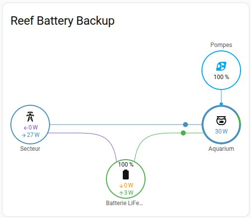
</p>

Vous pouvez visualiser les flux d'énergie du système batterie dans un tableau de bord Home Assistant avec [Power Flow Card Plus](https://github.com/flixlix/power-flow-card-plus) (HACS → Frontend).

La carte affiche les flux de puissance en temps réel entre le secteur, la batterie et les pompes individuelles (gyres ReefWave, pompe de remontée ReefRun, écumeur DC) avec des icônes dynamiques qui changent selon l'état des pompes.

#### Capteurs template pour les nœuds pompes

Ajoutez ces capteurs template dans votre `configuration.yaml` pour agréger les vitesses de pompes. Adaptez les entity IDs à vos appareils :

```yaml
template:
  - sensor:
      # L'icône, elle, n'est PAS définie ici parce que
      # `power-flow-card-plus` ne lit pas l'icône de l'entité ; elle
      # sera injectée dynamiquement par `config-template-card` au
      # niveau de la carte (cf. plus bas). Adapter les entity IDs.
      - name: "RSWave Gyre 1 Vitesse"
        unique_id: rswave_gyre1_speed
        unit_of_measurement: "%"
        state: >
          
          
          {{ [f, r] | max | round(0) }}
        attributes:
          direction: >
            
            
            → av← ar■

      - name: "RSWave Gyre 2 Vitesse"
        unique_id: rswave_gyre2_speed
        unit_of_measurement: "%"
        state: >
          
          
          {{ [f, r] | max | round(0) }}
        attributes:
          direction: >
            
            
            → av← ar■
```

#### Icônes dynamiques via `config-template-card`

`power-flow-card-plus` ne supporte qu'une icône statique par nœud `individual` ([discussion #355](https://github.com/flixlix/power-flow-card-plus/discussions/355)). Pour faire varier l'icône selon l'état des pompes (`redsea:gyre-off/min/med/max`, `redsea:pump-on/off`, `redsea:skimmer-on/off`), on enveloppe la carte dans [`config-template-card`](https://github.com/iantrich/config-template-card) (HACS → Frontend) : ce wrapper réévalue les variables `${...}` à chaque changement d'état des entités listées, et passe la config finalisée à la carte enfant.

Exemple complet fonctionnel (adaptez les entity IDs à vos appareils) :

```yaml
type: custom:config-template-card
variables:
  GYRE1_ICON: |
    (() => {
      const v = Math.max(
        parseFloat(states['sensor.rswave45_<your_wave1_id>_intensite_marche_avant'].state) || 0,
        parseFloat(states['sensor.rswave45_<your_wave1_id>_intensite_marche_arriere'].state) || 0
      );
      if (v <= 0) return 'redsea:gyre-off';
      if (v < 35) return 'redsea:gyre-min';
      if (v < 70) return 'redsea:gyre-med';
      return 'redsea:gyre-max';
    })()
  GYRE2_ICON: |
    (() => {
      const v = Math.max(
        parseFloat(states['sensor.rswave45_<your_wave2_id>_intensite_marche_avant'].state) || 0,
        parseFloat(states['sensor.rswave45_<your_wave2_id>_intensite_marche_arriere'].state) || 0
      );
      if (v <= 0) return 'redsea:gyre-off';
      if (v < 35) return 'redsea:gyre-min';
      if (v < 70) return 'redsea:gyre-med';
      return 'redsea:gyre-max';
    })()
  PUMP_ICON: |
    parseFloat(states['number.rsrun_<your_pump_id>_pump_1_vitesse'].state) > 0
      ? 'redsea:pump-on' : 'redsea:pump-off'
  SKIMMER_ICON: |
    parseFloat(states['number.rsrun_<your_pump_id>_pump_2_vitesse'].state) > 0
      ? 'redsea:skimmer-on' : 'redsea:skimmer-off'
entities:
  - sensor.rswave45_<your_wave1_id>_intensite_marche_avant
  - sensor.rswave45_<your_wave1_id>_intensite_marche_arriere
  - sensor.rswave45_<your_wave2_id>_intensite_marche_avant
  - sensor.rswave45_<your_wave2_id>_intensite_marche_arriere
  - number.rsrun_<your_pump_id>_pump_1_vitesse
  - number.rsrun_<your_pump_id>_pump_2_vitesse
card:
  type: custom:power-flow-card-plus
  title: Reef Battery Backup
  entities:
    battery:
      entity: sensor.reef_battery_backup_puissance
      state_of_charge: sensor.reef_battery_backup_soc_batterie
      name: Batterie LiFePO4
      icon: mdi:battery
      invert_state: true
      color:
        consumption: "#4caf50"
        production: "#ff9800"
      display_state: two_way
      show_state_of_charge: true
      state_of_charge_unit: "%"
      state_of_charge_decimals: 0
    home:
      entity: sensor.reef_battery_backup_energie_consommee
      name: Aquarium
      icon: mdi:fishbowl-outline
      color_value: true
    grid:
      entity: sensor.reef_battery_backup_tension_chargeur
      name: Secteur
      icon: mdi:transmission-tower
      color_value: true
      display_state: one_way
    individual:
      - entity: sensor.rswave_gyre_1_vitesse
        name: Gyre 1
        color: "#00bcd4"
        icon: ${GYRE1_ICON}
        unit_of_measurement: "%"
        display_zero: true
        secondary_info:
          template: |
            {{ state_attr('sensor.rswave_gyre_1_vitesse', 'direction') }}
      - entity: sensor.rswave_gyre_2_vitesse
        name: Gyre 2
        icon: ${GYRE2_ICON}
        color: "#00bcd4"
        unit_of_measurement: "%"
        display_zero: true
        secondary_info:
          template: |
            {{ state_attr('sensor.rswave_gyre_2_vitesse', 'direction') }}
      - entity: sensor.pompe_retour_vitesse
        name: Pompe retour
        icon: ${PUMP_ICON}
        color: "#2196f3"
        unit_of_measurement: "%"
        display_zero: true
      - entity: sensor.ecumeur_vitesse
        name: Écumeur
        icon: ${SKIMMER_ICON}
        color: "#ff2030"
        unit_of_measurement: "%"
        display_zero: true
  clickable_entities: true
  display_zero_lines:
    mode: show
    transparency: 50
  use_new_flow_rate_model: true
```

> 💡 Les icônes `redsea:gyre-*`, `redsea:pump-*` et `redsea:skimmer-*` proviennent du pack d'icônes personnalisées [ha-reefbeat-component](https://github.com/Elwinmage/ha-reefbeat-component).

---

## ⚠️ Important : ReefWave et synchronisation cloud

> **Les ReefWave sont « esclaves du cloud »** — ce sont les seuls équipements ReefBeat contrôlés par le cloud Red Sea plutôt qu'en local.

Quand reefbeat⚡Backup modifie le programme de vagues d'une ReefWave pendant une coupure (réduction d'intensité, passage en flux uniforme), il utilise l'**API HTTP locale** qui fonctionne parfaitement — l'appareil change immédiatement de comportement.

Cependant, le **cloud Red Sea et l'app mobile ne sont pas informés** de ce changement. Le cloud croit toujours que la ReefWave exécute son programme d'origine. Concrètement :

**Pendant la coupure :**
- ✅ La ReefWave tourne physiquement à l'intensité réduite (l'API locale fonctionne)
- ✅ Home Assistant voit l'état correct (lecture directe depuis l'appareil)
- ⚠️ L'app mobile ReefBeat affiche l'ancien programme (lecture depuis le cloud)

**Au retour du courant :**
- ✅ reefbeat⚡Backup restaure le programme de vagues original depuis son snapshot
- ✅ L'appareil, Home Assistant et l'app mobile sont de nouveau synchronisés
- ✅ Aucune intervention manuelle nécessaire

**En pratique**, ce n'est pas un problème : pendant une coupure, vous ne gérez pas les programmes de vagues depuis l'app. L'essentiel est que les pompes tournent physiquement à la bonne intensité, et que tout soit restauré correctement au retour du courant.

> 💡 Cette limitation ne concerne que les ReefWave. Les ReefRun (pompes de remontée, skimmers) sont contrôlés localement et restent synchronisés avec l'app en permanence.

---

## 🐛 Dépannage

Voir [TROUBLESHOOTING.md](TROUBLESHOOTING.md) pour les problèmes courants :

- `Failed to add edge detection` → installer `python3-rpi-lgpio`
- INA226 lit `0.000A` → vérifier le câblage en série du shunt
- Victron `'Scanner' has no attribute 'scan'` → version `victron-ble` incompatible
- MQTT discovery sensors absents → vérifier les credentials et le `base_topic`

---

## 📜 Licence

MIT

