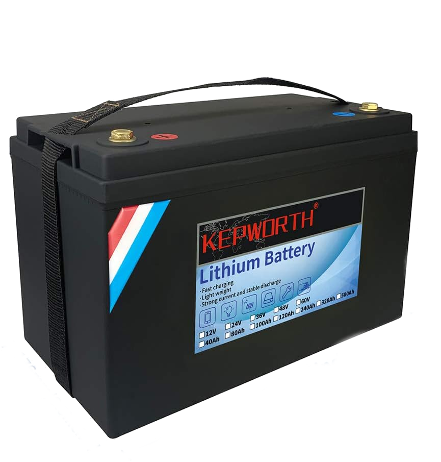
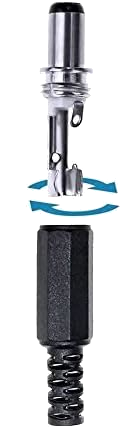
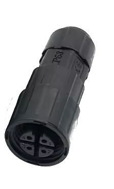
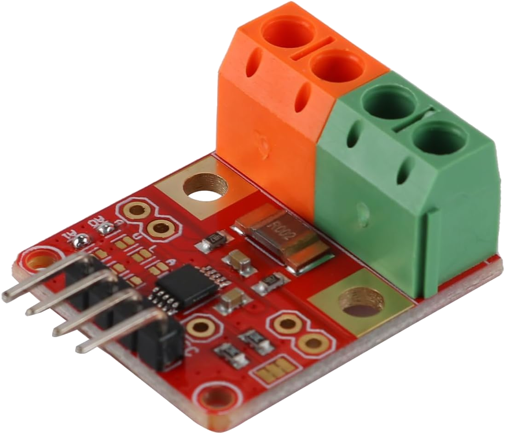
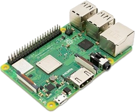
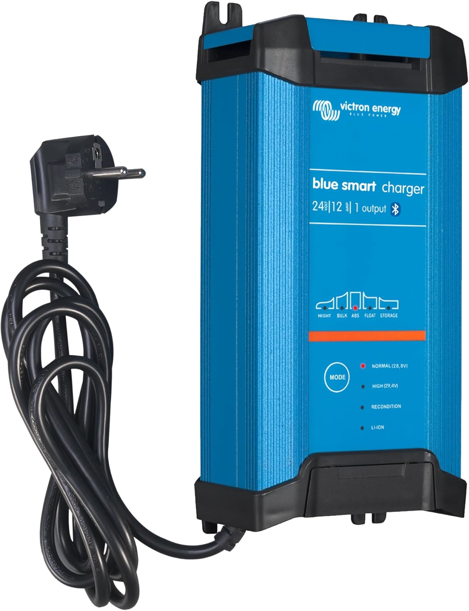
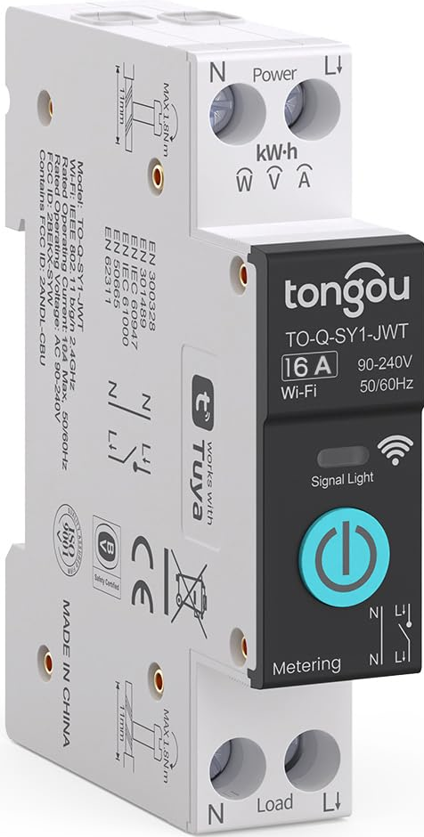
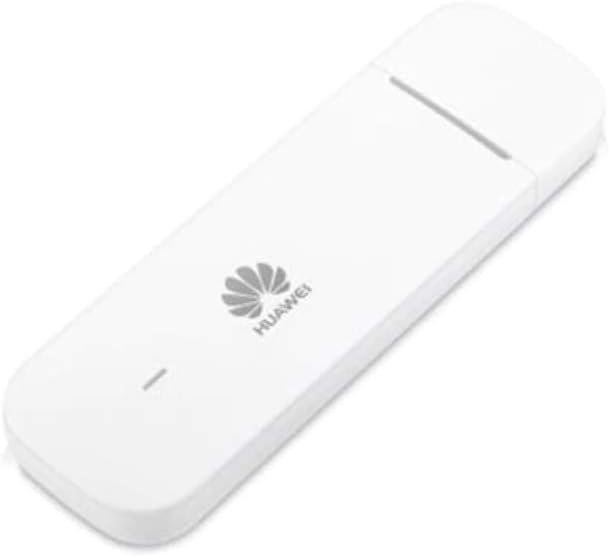

# reefbeat⚡Backup

[🇫🇷 Français](README.fr.md) · **🇬🇧 English**

---

Autonomous backup battery monitoring and management system for Red Sea reef aquariums (ReefWave, ReefRun, DC Skimmer, DC Pump).

## ⚡ Features

- **Battery monitoring** via INA226 (I2C, primary) + Victron BLE (optional auxiliary for charger state)
- **Instant outage detection** via 230V relay on GPIO
- **Progressive pump degradation** — SoC-based levels auto-computed from a target autonomy
- **Per-device control** — each ReefWave / ReefRun / Skimmer gets its own intensity per level
- **3-level network failover** — normal Wi-Fi → rejoin → autonomous hotspot
- **Push notifications** — via [ntfy.sh](https://ntfy.sh) (free, no account required) + 4G LTE failover
- **4G internet gateway** — when hotspot is active, routes ReefBeat traffic through 4G so the Red Sea mobile app keeps working
- **Home Assistant integration** — MQTT auto-discovery (10 sensors + charger if Victron)
- **MQTT buffer with replay** — data during HA outage is never lost
- **Auto-detection** — scans your network for ReefBeat devices during setup
- **Self-update** — checks GitHub for new versions, HA update entity with "Install" button
- **Bilingual** — FR/EN interface based on system locale

## 📋 Table of contents

- [Quick install](#-quick-install)
- [Hardware mounting levels](#-hardware-mounting-levels)
  - [Level 1 — Basic setup](#level-1--basic-setup)
  - [Level 2 — Normal setup (recommended)](#level-2--normal-setup-recommended)
  - [Level 3 — Advanced setup](#level-3--advanced-setup)
  - [Increasing autonomy](#increasing-autonomy)
- [Configuration](#-configuration)
- [Home Assistant](#-home-assistant)
- [Battery test blueprint](#-automatic-battery-test-blueprint)
- [Push notifications](#-push-notifications-ntfysh)
- [Project structure](#-project-structure)
- [Troubleshooting](#-troubleshooting)

---

## 🚀 Quick install

```bash
curl -sL https://raw.githubusercontent.com/Elwinmage/reefbeatEnergyBackup/main/install.sh | sudo bash
```

The installer:

1. Downloads the latest release
2. Enables I2C on the Pi if needed (`raspi-config nonint do_i2c 0`)
3. Installs `python3-rpi-lgpio` (Pi 5 / kernel 6.6+ compatible) and Python dependencies
4. Launches the interactive wizard which:
   - Scans the network for ReefBeat devices
   - Retrieves Wi-Fi SSID and MAC addresses from your devices
   - Auto-detects your Raspberry Pi model
   - Computes SoC levels from a **target autonomy** (12h, 24h…)
   - Configures battery, INA226 monitoring + optional Victron, MQTT
5. Installs and enables the systemd service
6. Optionally starts the service immediately

## 🔄 Service management

The installer creates a systemd service called `reefbeat-energy-backup`:

```bash
# Status
sudo systemctl status reefbeat-energy-backup

# Start / stop / restart
sudo systemctl start reefbeat-energy-backup
sudo systemctl stop reefbeat-energy-backup
sudo systemctl restart reefbeat-energy-backup

# Live logs
sudo journalctl -u reefbeat-energy-backup -f

# Disable auto-start on boot
sudo systemctl disable reefbeat-energy-backup
```

To reconfigure at any time:

```bash
python3 ~/scripts/reefbeatEnergyBackup/configure.py
sudo systemctl restart reefbeat-energy-backup
```

---

## 🔧 Hardware mounting levels

The system is built in three levels, each adding functionality. You can start at level 1 and upgrade progressively.

### Level 1 — Basic setup

> **Goal**: provide battery backup for pumps during power outages, without monitoring or automation.

#### 📦 Hardware

| Component | Suggested model | Approx. price |
|---|---|---|
|  **LiFePO₄ battery 24V 60Ah** *(24V/5A charger included)* | [Kepworth 24V 60Ah](https://www.amazon.fr/dp/B0F3X3LB9K) | ~260 € |
|  **Jack adapter for ReefWave** | 5.5 × 2.1 mm barrel jack to bare wires | ~5 € |
|  **IP68 4-pin connector for ReefRun/Skimmer** | [IP68 4-pole connector](https://fr.aliexpress.com/item/1005009386771716.html) | ~5 € |
| Wiring (2.5 mm² red/black wire, crimps, heatshrink, 15A fuse) | — | ~20 € |

**Level 1 budget: ~290 €**

> 🔊 **Noise note**: the charger included with the Kepworth battery has an active cooling fan that is relatively noisy. If you plan to install it near a living area, place it further away (utility room, garage) or go directly to [level 3](#level-3--advanced-setup) with the Victron Blue Smart charger, which is much quieter (passive cooling at low charge).

#### 🔌 Wiring diagram

```
                 230 V
                   │
                   ▼
            ┌─────────────┐
            │   Charger   │
            │ 24V 5A inc. │ ← included with battery
            └──────┬──────┘
                   │  24V DC
                   ▼
            ┌─────────────┐
            │   Battery   │
            │  LiFePO₄    │  ← stores energy
            │  24V 60Ah   │
            └──────┬──────┘
                   │  24V DC (with 15A fuse)
        ┌──────────┼──────────┐
        │          │          │
        ▼          ▼          ▼
    ┌───────┐ ┌────────┐ ┌─────────┐
    │ReefRun│ │ReefWave│ │DC Skim. │
    │+pumps │ │  jack  │ │connect. │
    └───────┘ └────────┘ └─────────┘
```

#### 📝 How it works

The principle: **the battery sits in parallel between the charger and the loads**. It is constantly maintained at full charge by the charger (included with the Kepworth battery) in float mode, and automatically supplies power when mains drops — no switch, no electronics in between.

- **ReefWave**: uses the **5.5 × 2.1 mm barrel jack** connector (positive center)
- **ReefRun and DC Skimmer**: use the **IP68 4-pin waterproof connector** proprietary to Red Sea (the pump includes its own regulator, raw 24V is fine)
- The included charger stays plugged in permanently: it automatically switches to float mode once full charge is reached

> ⚠️ **Safety**: a **15A fuse** on the battery + pole, right after the battery, is mandatory. This rating matches the 2.5 mm² cable capacity (~16A max) and provides comfortable margin against typical peak consumption of ~9A (2× ReefWave 45 + ReefRun 12000 + Skimmer + Pi). In case of a short circuit on the load side, this is what saves the battery (and your house).

#### ✅ What you get

- Power continuity during outages (autonomy ~6-12h depending on your pumps)
- No intervention needed when power cuts
- No monitoring, no degradation: pumps run at 100% until the battery is empty

#### ❌ Limitations

- No visibility on battery state
- No degradation management: battery drains fast, everything shuts off at once
- Risk of repeated deep discharge → accelerated aging

---

### Level 2 — Normal setup *(recommended)*

> **Goal**: add real-time battery monitoring, automatic outage detection, and progressive pump degradation based on SoC. This is the **recommended** level for a permanent installation.

#### 📦 Additional hardware (on top of level 1)

| Component | Suggested model | Approx. price |
|---|---|---|
|  **INA226 module 0-36V/20A** (2 mΩ onboard shunt) | [Fasizi INA226 20A](https://www.amazon.fr/dp/B0B7MYYT2V) | ~14 € |
|  **Raspberry Pi 3 B+** (or newer) | [Pi 3 B+ 1GB at Kubii](https://www.kubii.com/fr/cartes-nano-ordinateurs/2119-raspberry-pi-3-modele-b-1-gb-kubii-5056561800318.html) | ~40 € |
| 16 GB class 10 microSD + Pi USB power supply | — | ~15 € |
| DC-DC converter 24V → 5V 3A for the Pi | Step-down buck regulator | ~8 € |
|  **Finder 40.61.8.230.4000 relay** (230V coil, 1 NO/NC) | [Finder 40.61](https://www.amazon.fr/dp/B003A611AE) | ~12 € |
|  **Finder 95.95.3 DIN socket** | [Finder 95.95.3](https://www.amazon.fr/dp/B0018L99AC) | ~8 € |
| 35 mm DIN rail (10 cm) + small electrical enclosure | — | ~15 € |

**Additional budget: ~112 €** — **Cumulative level 2 budget: ~402 €**

#### 🔌 Wiring diagram

```
                 230 V ─────┬───────────────┐
                            │               │
                            ▼               ▼
                     ┌─────────────┐   ┌──────────┐
                     │   Charger   │   │  Relay   │
                     │ Victron 24V │   │  Finder  │
                     └──────┬──────┘   │   40.61  │
                            │ 24V      │  coil    │
                            ▼          │   230V   │
                     ┌─────────────┐   └────┬─────┘
                     │   Battery   │        │ NO/NC
              ┌──────┤  LiFePO₄    │        │ contact
              │      └──────┬──────┘        │
              │             │ 24V           │
              │      [Shunt INA226]         │
              │             │               │
              │             ▼               │
              │    ┌────────────────┐       │
              │    │ DC-DC 24V→5V  │       │
              │    └────────┬───────┘       │
              │             │ 5V            │
              │             ▼               │
              │    ┌────────────────┐       │
              ├────│  Raspberry Pi  │◄──────┘
              │I2C │   GPIO 26     │ GPIO state
              │SDA │   GPIO 2 SDA  │
              │SCL │   GPIO 3 SCL  │
              │    └────────────────┘
              │
              ▼
       ReefRun / ReefWave / DC Skimmer
```

#### 📝 Wiring details

**INA226 shunt wiring** (most important):

The INA226 module must be **in series on the battery + pole**, between the battery and all loads. This is what allows it to measure net current in/out.

```
Battery (+) ──► [IN+ shunt INA226 IN−] ──► Bus + 24V ─┬─► Charger (output)
                                                        ├─► DC-DC to Pi
                                                        ├─► ReefRun
                                                        ├─► ReefWave
                                                        └─► DC Skimmer

Battery (−) ──────────────────────────► Bus − (common)
```

The shunt sees:
- **positive current** = battery is discharging (supplying loads)
- **negative current** = battery is charging (from charger)

**Outage detection relay wiring**:

The Finder 40.61.8.230 is a **mains voltage absence detector**: its coil is powered by 230V, its NO/NC contacts switch when mains drops.

| Socket 95.95.3 terminal | Connection |
|---|---|
| A1 | 230V Phase |
| A2 | 230V Neutral |
| 11 (common) | Pi GND |
| 12 (NC) | Pi GPIO 26 (with internal pull-up) |

Mains OK → coil energized → NC contact open → GPIO reads 1 (pulled to 3.3V).
Outage → coil drops → NC contact closes → GPIO pulled to GND, reads 0.

**Pi → INA226 connections** (4 wires):

| Pi GPIO | INA226 |
|---|---|
| Pin 1 (3.3V) | VCC |
| Pin 6 (GND) | GND |
| Pin 3 (GPIO 2 SDA) | SDA |
| Pin 5 (GPIO 3 SCL) | SCL |

#### ✅ What you get

- **Real-time monitoring**: battery voltage, current, power, SoC via coulomb counting
- **Outage detection in < 1 second** via the relay
- **Automatic degradation**: ReefWaves drop to 70%, then 50%, then 10% as SoC decreases; skimmer turns off in survival mode; etc.
- **Configuration snapshots**: at outage, original pump config is saved to disk; on power restore, it's restored identically
- **MQTT buffer**: while HA is down (which almost always happens during a real outage), measurements are stored locally and replayed when the broker comes back → you get the **complete discharge curve** in HA
- **Network failover**: if the Wi-Fi router also goes down, the Pi switches to hotspot mode to stay reachable

---

### Level 3 — Advanced setup

> **Goal**: add remote charger monitoring, a connected circuit breaker for **scheduled discharge tests**, and 4G LTE backup for notifications when all networks are down.
>
> The three additions of this level are **independent** — you can install any combination of them:

| Addition | Purpose | Can be installed alone? |
|---|---|---|
| 🔌 **Victron BLE charger** | Silent charger + charger state in HA | ✅ Yes |
| ⚡ **Connected circuit breaker** | Automated discharge tests from HA | ✅ Yes |
| 📶 **4G LTE USB modem** | Send notifications when Wi-Fi is down | ✅ Yes |

#### 📦 Additional hardware (on top of level 2)

| Component | Suggested model | Approx. price |
|---|---|---|
|  **Victron Blue Smart IP22 24/12** *(replaces Kepworth charger — silent + BLE)* | [Victron Blue Smart IP22 24/12](https://www.amazon.fr/dp/B08P4Z8NL6) | ~155 € |
|  **Connected Wi-Fi circuit breaker 16A with meter** | [Tongou TO-Q-SY1-JWT](https://www.amazon.fr/dp/B08ND2RGX8) | ~30 € |
|  **Huawei E3372h-320 4G LTE USB modem** | [Huawei E3372h-320](https://www.amazon.fr/HUAWEI-51071SMK-Huawei-E3372h-320-LTE-Stick/dp/B085RDTZMP) | ~40 € |

**Maximum additional budget: ~225 €** (all three) — **Cumulative level 3 budget: ~627 €**

#### 🔌 Wiring diagram

```
        230 V ──► [Tongou Wi-Fi breaker] ──┬──────────────┐
                                            │              │
                                            ▼              ▼
                                     ┌─────────────┐   ┌──────────┐
                                     │  Charger    │   │  Relay   │
                                     │Victron BLE  │   │  Finder  │
                                     │24/12 Smart  │   │detection │
                                     └──────┬──────┘   └────┬─────┘
                                            │ 24V           │
                                            ▼               │
                                     ┌─────────────┐        │
                                     │   Battery   │◄───[shunt INA226]
                                     └──────┬──────┘        │
                                            │ 24V           │
                                            ▼               │
                                      (loads)               │
                                                            │
                                      ┌──── Wi-Fi ───┐      │
                                      │              │      │
                                      ▼              ▼      │
                                Home Assistant   Raspberry Pi
                                (Tongou            GPIO 26 ◄┘
                                 integration)       │
                                      │           USB │
                                      │ BLE          ▼
                                      ▼        ┌───────────┐
                                Victron charger │  Huawei   │
                                (real-time)     │ E3372h    │
                                                │  4G LTE   │
                                                └───────────┘
```

#### 📝 Details

**Tongou TO-Q-SY1-JWT circuit breaker**:

A DIN-rail modular breaker controlled via Wi-Fi (Tuya protocol, integrable with HA via [Local Tuya](https://github.com/rospogrigio/localtuya) or the official Tuya Cloud integration). It also provides real-time kWh / V / A measurement — useful to verify the charger switches to battery when simulating an outage.

**Wiring**: the breaker is installed **just before** the Victron charger and the Finder relay. When you switch it off from HA, it's exactly like a real power outage:

- The charger stops providing power
- The Finder relay sees the voltage absence → contact switches
- The Pi sees the outage via GPIO and immediately triggers degradation

**Victron Blue Smart IP22 24/12 charger (with BLE)**:

Replaces the Kepworth charger included with the battery. Besides adding Bluetooth Low Energy, **it is significantly quieter**: passive cooling at low charge, the fan only kicks in at full charge above 8A. Ideal if the system is installed in a living area.

Publishes to HA:
- Charger state (`storage` / `bulk` / `absorption` / `float`)
- Real-time output voltage and current
- Error codes (overheat, battery voltage out of range…)

Configuration: retrieve the **encryption key** from the VictronConnect app (Settings → Product Info → Instant Readout → "Show"), enter it in the configuration wizard.

**Huawei E3372h-320 4G LTE USB modem**:

<p align="center">
  
</p>

LTE Cat4 150 Mbps, bands 1/3/7/8/20 (800/900/1800/2100/2600 MHz), plug-and-play HiLink mode. Just plug it into the Pi's USB port with an active SIM card — it creates a virtual Ethernet interface (`eth1`), no driver or PPP configuration needed.

When Wi-Fi and home router are both down, the notifier automatically detects the modem, checks cellular connectivity, and routes ntfy.sh notifications through 4G. HiLink web interface available at `http://192.168.8.1` for signal/status monitoring.

**4G internet gateway for ReefBeat devices**: when the RPi hotspot is active and this option is enabled, the RPi acts as a NAT router — it forwards internet traffic from the ReefBeat devices (connected to the hotspot) through the 4G modem. This means the **Red Sea mobile app keeps working** during a power outage, as the ReefBeat controllers can still reach the Red Sea cloud servers.

#### ✅ What you get

- **Remote mains control** to the battery from HA
- **Scheduled discharge tests**: see the [blueprint section](#-automatic-battery-test-blueprint)
- **Full charger visibility** (mode, current, errors)
- **Total consumption measurement** in kWh via the Tongou breaker
- **Notifications even when everything is down** via 4G LTE
- **Red Sea mobile app keeps working** during outages (4G gateway routes ReefBeat traffic to the cloud)

---

### Increasing autonomy

> **Goal**: double (or more) battery capacity for longer outages.

The simplest and safest method is adding one or more **identical batteries in parallel**. LiFePO₄ batteries with internal BMS (like the Kepworth 24V 60Ah) natively support parallel operation.

#### 📦 Hardware per additional battery

| Component | Approx. price |
|---|---|
| 1× identical LiFePO₄ 24V 60Ah battery | ~260 € |
| 2× interconnect cables 2.5 mm² (50 cm red + 50 cm black, crimped) | ~10 € |
| 1× inline **15A fuse** (one per additional battery) | ~3 € |

**Budget per +60 Ah: ~273 €**

#### 🔌 Parallel wiring diagram

```
                Bus + (to charger and loads)
                      ▲
                      │
        ┌─────────────┼─────────────┐
        │             │             │
   [fuse]        [fuse]        [fuse]
   15 A          15 A          15 A
        │             │             │
   ┌────┴────┐   ┌────┴────┐   ┌────┴────┐
   │ Bat #1  │   │ Bat #2  │   │ Bat #3  │
   │24V 60Ah │   │24V 60Ah │   │24V 60Ah │
   └────┬────┘   └────┬────┘   └────┬────┘
        │             │             │
        └─────────────┼─────────────┘
                      │
                      ▼
                Bus − (common)
```

#### 📝 Important rules

1. **Identical batteries only**: same brand, same model, ideally same age. Mixing batteries of different capacities or ages overworks the weakest one → accelerated aging.
2. **Initial balancing**: before connecting in parallel, charge each battery individually to 100% and verify they are at the same voltage (±0.1V). Otherwise, equalization will occur through high current between batteries → risk of melting crimps.
3. **Equal cross-section cables**: if one battery has a longer or thinner cable, it will discharge less → permanent imbalance.
4. **One fuse per battery**, not a single common fuse: if one battery fails, only that one is isolated.
5. **No change to the INA226 shunt**: it stays on the common bus and sees the **total** combined current from both batteries — exactly what we want for SoC.

#### 📊 Cumulative capacities and estimated autonomies

For a typical setup (2× ReefWave 45 + 1× ReefRun 12000 + DC Skimmer + Pi):

| Configuration | Usable capacity | 24h target autonomy |
|---|---|---|
| 1× 60 Ah | 1228 Wh | achievable (estimated 32h) |
| 2× 60 Ah | 2457 Wh | comfortable (estimated 60h+) |
| 3× 60 Ah | 3686 Wh | luxurious (90h+) |

> ⚠️ Re-run the `configure.py` wizard after adding a battery to update the total capacity in `config.json`. The scenario calculation will account for it automatically.

---

## ⚙️ Configuration

The `configure.py` wizard is interactive and bilingual (FR/EN based on locale). It guides through several steps:

1. **Network** — Wi-Fi SSID confirmation (read from NetworkManager)
2. **ReefBeat device detection** — automatic subnet scan, select devices to back up
3. **Outage detection** — relay GPIO (recommended) or current monitoring
4. **Battery** — pack capacity (Ah)
5. **Monitoring** — INA226 (mandatory, auto-detected on I2C) + Victron BLE (optional)
6. **Backup mode** — choose between:
   - **Auto** (recommended): set a target autonomy, the wizard detects the Pi, asks about auxiliary loads, and computes optimal SoC levels + intensities
   - **Simple**: a single backup speed for everything
7. **MQTT** — Home Assistant connection settings
8. **Push notifications** — ntfy.sh topic + 4G LTE failover
9. **Polling interval**

The result is saved in `config.json` and can be edited manually if needed.

---

## 🏠 Home Assistant

### Auto-published sensors

All sensors appear automatically in HA after MQTT discovery configs are published.

| Sensor | Description |
|---|---|
| `sensor.reef_battery_voltage` | Battery voltage (V) |
| `sensor.reef_battery_current` | Current (A, + = discharging) |
| `sensor.reef_battery_power` | Power (W) |
| `sensor.reef_battery_soc` | State of Charge (%) |
| `sensor.reef_battery_power_state` | mains / battery |
| `sensor.reef_battery_pump_intensity` | Average pump intensity (%) |
| `sensor.reef_battery_runtime` | Estimated runtime (h) — always shows "if power cuts now" |
| `sensor.reef_battery_outage_duration` | Current outage duration (min) |
| `sensor.reef_battery_network_mode` | client / rejoin / hotspot |
| `sensor.reef_battery_monitor_source` | ina226 |

**If Victron BLE is configured** (level 3):

| Sensor | Description |
|---|---|
| `sensor.reef_battery_charger_voltage` | Charger output voltage (V) |
| `sensor.reef_battery_charger_current` | Charger output current (A) |
| `sensor.reef_battery_charger_state` | bulk / absorption / float / storage |
| `sensor.reef_battery_charger_error` | no_error / … |

### MQTT buffer

During an outage, HA and the MQTT broker are almost always unavailable (they're on the same infrastructure as the mains). The service writes all measurements to `/var/lib/reef-battery-monitor/mqtt/messages.jsonl` and replays them automatically when the broker comes back → you get the complete curve after the fact, with no gaps.

Optional configuration in `config.json`:

```json
"mqtt": {
  "buffer_dir": "/var/lib/reef-battery-monitor/mqtt",
  "buffer_retention_days": 7
}
```

---

## 📱 Push notifications (ntfy.sh)

Receive alerts directly on your phone without Home Assistant, using the free [ntfy.sh](https://ntfy.sh) service.

**Setup:**
1. Install the ntfy app ([Android](https://play.google.com/store/apps/details?id=io.heckel.ntfy) / [iOS](https://apps.apple.com/app/ntfy/id1625396347))
2. Subscribe to your topic (configured during wizard setup)
3. That's it — notifications are sent automatically on power outage

**Notification events** (only triggered during outages):
- ⚡ Power outage detected (with SoC and estimated runtime)
- ✅ Power restored (with outage duration)
- 🟡🟠🔴 Pump level changes (eco → survival → critical)
- 🚨 Battery critically low (repeated alerts every 60s)
- 📡 Network failover status

**Priorities:** outage = `high` (sound), critical = `urgent` (persistent alarm), info = `default` (silent)

**Test from the command line:**

```bash
python3 test_notif.py                     # Simple test
python3 test_notif.py --type outage       # Simulate power outage
python3 test_notif.py --type critical     # Simulate critical battery (alarm)
python3 test_notif.py --type restored     # Simulate power restored
python3 test_notif.py --lte              # Force send via 4G modem
python3 test_notif.py --message "Hello"   # Custom message
```

---

## 🤖 Automatic battery test blueprint

> **Available only with level 3** (Tongou circuit breaker required).

This Home Assistant blueprint periodically triggers a **real discharge test**: it switches off the mains breaker for 40 minutes, observes the discharge curve, and compares it to the forecast computed by the scenario.

### How it works

```
Scheduled date (e.g.: last Sunday of the month, every 3 months)
      │
      ▼
Is "user" detected at home?
      │
      ├─── No ──► Test silently cancelled
      │
      └─── Yes
              │
              ▼
        Actionable HA notification on phone
        "Run battery test for 40 min?"
        (no timeout: waits for explicit response)
              │
              ├─── Decline ──────────────► Cancelled
              │
              └─── Accept
                      │
                      ▼
              Breaker OFF
              Initial SoC / voltage / power saved
              Forecast computed (power × duration / capacity)
                      │
                      ▼
              Wait 40 min, OR immediate abort if voltage < threshold
              (service switches to battery mode,
               MQTT buffer records everything)
                      │
                      ▼
              Breaker ON
                      │
                      ▼
              3-axis analysis:
                📊 Forecast: actual SoC consumed vs prediction
                🔋 Voltage profile: final voltage in LFP plateau?
                ⏱  Extrapolated autonomy to 20% SoC
                      │
                      ▼
              Summary notification to phone + HA log
```

### Blueprint installation

The blueprint is provided in the repo under [`blueprints/reef_battery_test.yaml`](blueprints/reef_battery_test.yaml).

To install in HA:

1. Copy the file to `<config>/blueprints/automation/reefbeat/reef_battery_test.yaml`
2. Reload blueprints in HA (Settings → Automations → ⋮ → Reload)
3. Create a new automation from this blueprint
4. Fill in: schedule, person, notification service, breaker switch, SoC/voltage/power sensors, battery capacity, test duration, tolerance, emergency voltage threshold

### Important precautions

⚠️ **Never run a test with nobody home**: if the battery is in poor condition or the scenario is miscalibrated, the test could cause total pump shutdown after the 40 minutes. A human must be able to intervene manually.

⚠️ **First use**: run a **manual** test first (flip the breaker by hand for 5-10 min) to verify the entire system reacts correctly before scheduling automated 40-min tests.

⚠️ **Timing**: avoid feeding hours for fish/corals. Choose a quiet time slot.

---

## 📁 Project structure

```
install.sh                          Installer (curl | bash)
configure.py                        Interactive wizard
config.example.json                 Default template
config.json                         Your configuration (generated by wizard)
main.py                             Main service loop
monitor.py                          INA226 backend + Victron BLE auxiliary
outage.py                           Outage detection (relay GPIO)
hotspot.py                          3-level network failover
controller.py                       Pump control + outage orchestration
notifier.py                         Push notifications (ntfy.sh + 4G LTE)
test_notif.py                       CLI notification tester
updater.py                          Self-update module (GitHub + HA update entity)
update.py                           CLI update tool
VERSION                             Current version number
mqtt_buffer.py                      MQTT buffer with replay
power_estimation.py                 Power tables + scenario builder
ble_scan.py                         Victron BLE scanner (used by wizard)
setup.py                            Dependency installer
docs/
  images/                           Component images for documentation
blueprints/
  reef_battery_test.yaml            HA battery test blueprint
```

---

## 🔧 CLI tools

| Command | Description |
|---------|-------------|
| `python3 configure.py` | Reconfigure (re-run the wizard) |
| `python3 test_notif.py` | Test push notifications |
| `python3 update.py` | Check for updates |
| `python3 update.py --install` | Install available update |
| `python3 ble_scan.py` | Scan for Victron BLE devices |
| `python3 setup.py --check` | Verify dependencies and hardware |

---

## 🔄 Updates

### From Home Assistant

An `update` entity appears automatically in HA (`update.reef_battery_update`). It shows the current and latest version, with an **Install** button when an update is available — just like any HA add-on.

The service checks GitHub every 6 hours (configurable). After clicking "Install", the update is downloaded, config.json is backed up, and the service restarts automatically.

### From the command line

```bash
cd ~/scripts/reefbeatEnergyBackup

# Check for updates
python3 update.py

# Install update
python3 update.py --install

# Force reinstall
python3 update.py --force

# Show current version
python3 update.py --version
```

---

## ⚠ Migration from older versions

If you previously installed as `reef-battery-monitor`, remove the old service:

```bash
sudo systemctl stop reef-battery-monitor
sudo systemctl disable reef-battery-monitor
sudo rm /etc/systemd/system/reef-battery-monitor.service
sudo systemctl daemon-reload
```

The new service is called `reefbeat-energy-backup`.

---

## 🐛 Troubleshooting

See [TROUBLESHOOTING.md](TROUBLESHOOTING.md) for common issues:

- `Failed to add edge detection` → install `python3-rpi-lgpio`
- INA226 reads `0.000A` → verify shunt is wired in series
- Victron `'Scanner' has no attribute 'scan'` → incompatible `victron-ble` version
- MQTT discovery sensors missing → check credentials and `base_topic`
- `runtime_h` shows `-1.0` → update to latest version (fixed)

---

## 📜 License

MIT

## 🔗 Related projects

- [ha-reefbeat-component](https://github.com/Elwinmage/ha-reefbeat-component) — Home Assistant integration for Red Sea ReefBeat devices
- [ha-reef-card](https://github.com/Elwinmage/ha-reef-card) — Lovelace card for reef tank management
